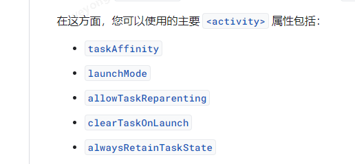
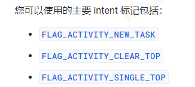
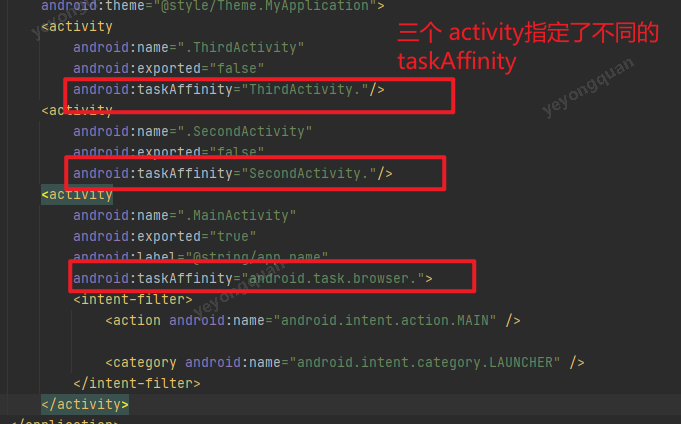
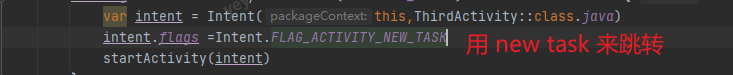
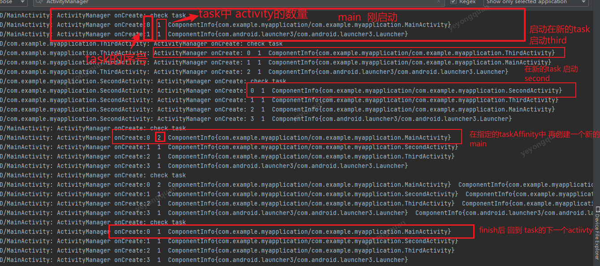
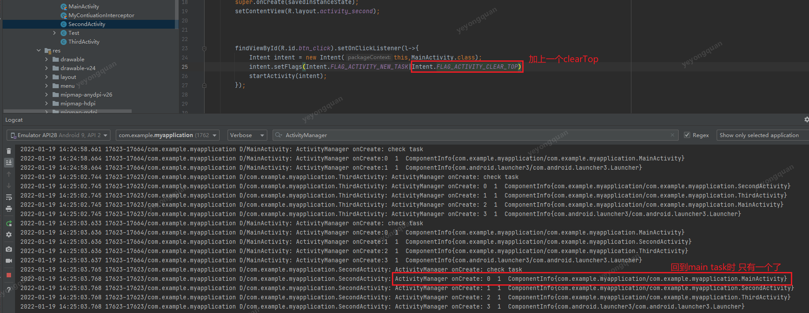

# Activity

## Activity的生命周期

onCreate
onStart
onResume
onRestart
onPause
onStop
onDestroy

## Activity的管理

activity是通过task来管理的
根据android 官方文档,主要用如下的标签来进行管理。

常用的标记有

taskAffinity

给activity增加  关系的
是配合 new task 来使用的。

如果说用了new task 但是taskAffinity是一致的话，那么还是会在同一个task中启动。

做一个测试

用Main  ->  Third -> Sec ->Main --> finish 的启动

做下调整

加了 clearTOP 之后 就老的 activity就被删除了。 

如果是用single top 和clear top 配合使用的话， 那么就是把用task中 之前有的

