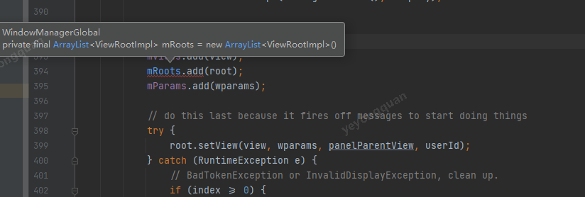
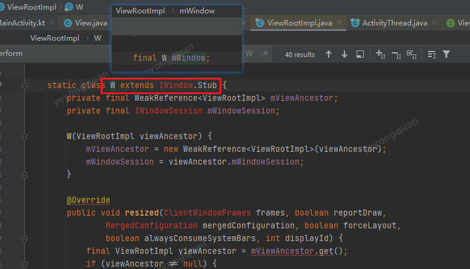
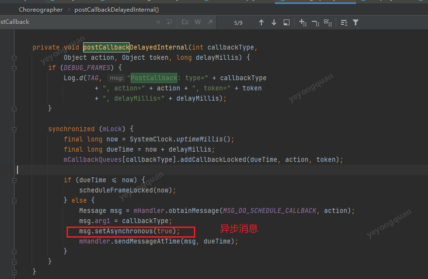
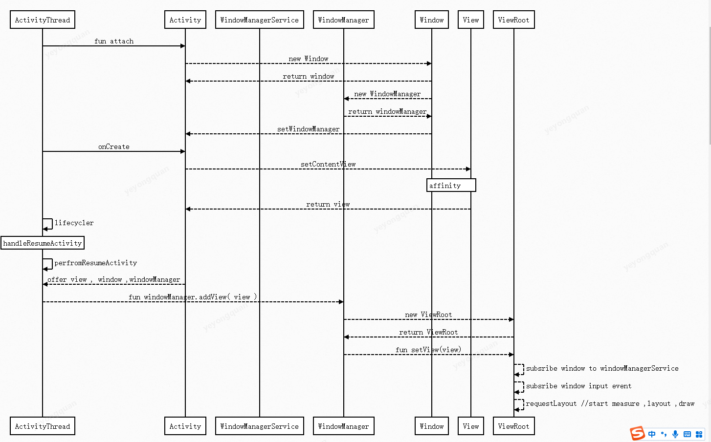

# Activity

## Activity的生命周期


onCreate
onStart
onResume
onRestart
onPause
onStop
onDestroy


## Activity的管理

activity是通过task来管理的
根据android 官方文档,主要用如下的标签来进行管理。


常用的标记有


taskAffinity - 指定activity所属的task


taskAffinity是给activity指定所在task
是配合 new task 来使用的。
可以理解为 设置 task的名称。

如果说用了new task 但是taskAffinity是一致的话，那么还是会在同一个task中启动。


做一个测试


用Main  ->  Third -> Sec ->Main --> finish 的启动


做下调整


加了 clearTOP 之后 就老的 activity就被删除了。 

如果是用single top 和clear top 配合使用的话， 那么就是把用task中 之前有的

从上面的测试中可以得出一下结论：

1.  new task 需要和 taskAffnifity配合 才能真正的new task
2. clear top 针对的是 本task中

### 获取栈顶Activity对象

前面通过 Activity_Service 只能获取到栈顶activity的名称。
并不能直接获取对象。

要想在程序的任意位置都获取到 当前activity任务栈顶部activity , android 中并没有直接的api， 但是可以通过application类下的ActivityLifecycleCallback 接口来获取。

#### ActivityLifecycleCallback

ActivityLifecycleCallback中包含了全部的activity的生命周期的回调。


通过这个ActivityLifecycleCallback ,从而就能构建


## Activity View的测绘

### View的测绘的起点

从一个面试题入手
Q：如何在Activity的onCreate和onResume 中获取一个view的height/width?

A:
onCreate中直接拿view的height/width是为0的。
因为view的测绘流程还未开始，要在onCreate拿height的话，可以用view.post来拿。
也可以给view add 一个globalLayoutListener.


ok 前面的QA中有了一个结论 view的测绘不是在onCreate中的。
接下来分析 view的测绘是从哪里开始的。

没思路只能猜测：

直观上的感觉是 setContentView中开始的。

先来分析 Activity.setContentView


观察一下，


在activity的setContentView(view)中， 创建了一个viewGroup 并且 赋给了 window .

接着看看window.setContentView里面做了啥。

PhoneWindow是android中window的唯一实现类。


从上图可知，phoneWindow.setContentView
中创建了一个decorView ，并且和该window进程了绑定，

然后初始化了 mContentParent ，并且把activity传过来的view， 添加到 mContentParent当中。

这里有个问题 window 是哪里来的呢？

明显不是onCreate, onCreate的代码量很少。
所以得往更早的activity的函数去找。
那就想到 attach函数。


发现attach方法中 初始化了  成员变量 window

ok， 现在就是已经把 用户指定的 view添加到了 
activity的window(由attach 方法创建)   然后再有setContentView触发，  new 一个decorView 和window相互绑定，   用户指定的 view 在添加到decorView的当中去。

但是这个过程并没有 涉及到绘制的流程。


在回到 activity的生命周期中。
onstart /onResume 的代码都很简单，没有涉及到View的测绘相关代码。

这样就得往底层走了，找到activity的生命周期的驱动 ActivityThread中。

在ActivityThread.handleResumeActivity函数中看到如下代码：


在ActivityThread中， 在执行完 perfromResume后
调用了viewManager.add( r.window.getDecorView() )
也就是把   activity的view  添加到了 windowManager当中。这里会遇到一个问题 ，发现windowManger 是一个抽象方法， 并且找不到其实现类。

但是看 window的windowManage的赋值里有线索。


发现其实现类就是WindowManagerImpl

PS : android studio 中找不到实现类的时候一般可以看看 *Imple，比如WindowManager ,Context 

所以接下来要看的就是WindowManagerImpl类。WindowManagerImpl

接下来查看 WindowManagerImlp ，


发现只是做了下转发。

转发给了WindowManagerGlobal
WindowManagerGlobal 其实就是应用的统一windwomanager入口。 
一个页面就有一个windowManager ,每一个windowManager都由WindowManagerGlobal来维护。

所以对于应用外部来说， 应用内的所有的增删改查 都是WindowManagerGlobal来完成的。




从上面可以分析出

roots 是WindowManagerGlobal 维护的 root的集合。
对于view来说  view被root 绑定到一块了 就说明 view 开始测绘了。


前面知道了ViewRootImpl是view的测绘的管理类 接下来分析ViewRootImpl

### ViewRootImpl- View测绘的管理处

先来对ViewRootImpl的做个整体的认识。


从上图可知：

-  viewRootimpl 把window通过系统服务添加到了 系统当中
- viewRootImpl对view有管理
- viewRootImpl 对 系统的vsync  （垂直同步信号）做了监听
  通过该监听来触发测绘 
- viewRootImpl 对 屏幕输入事件 进行了监听，
  通过该监听来处理点击事件 和手势分发

### 注册window并且 注册 手势监听的回调

下面就是向windowManagerService 注册window的代码， 注册时还传入了 手势监听的回调。


这里注册的window是 一个aidl 接口， sWindowSession 也是从aidl的接口获取的函数，
所以说系统就能通过aidl调用到 该进程的ViewRoot的相关函数的能力了



注册过去后  就有了

要注意ViewRootImpl 本身不是view ，只是实现了ViewParent的接口
把view和viewRootImpl关联起来，viewRootImpl 就是传入的decorView的ViewParent


这样就把view和viewRootImpl 关联起来的。

注册屏幕点击实现的响应


### 测绘触发点

requestLayout

上图就是 著名的  只能在主线程更新的异常。

这个异常就是在ViewRootImpl 中被抛出的。

所以说  view 在更新数据的时候 ，如果没有执行到viewRootImpl的requestLayout()方法的话， 那么就算在子线程中，也是可以进行ui更新的。因为没有线程检查。

在子线程当中去更新UI 也是有应用的，比如 如果想要页面一展示出来就能立刻的把相关内容都显示出来，就可以采用在子线程当中更新的策略

比如 手机淘宝的首页， 基本loading界面一结束 内容都出来的。 为啥呢？
就是其实在 引导页的时候 子线程就已经在加载页面了。

线程检查完之后就进行事务处理


Choroegrapher的postCallback 实际上就是post一个handler的异步消息。



设置好垂直同步信号的监听之后，再收到垂直同步信号之后 就会调用mTravesalRunnable


performTraversals 就是触发绘制的地方.
performTraversals 会根据 当前的view树是否发生变化 ，包括大小、 属性；来判断是否需要重新测绘，重新布局，重新绘制


performTraversals 中就会调用 performMeasure、 performLayout、 以及performDraw

他们内部就会分别调用 decorView的 measure 、layout、 和draw


这里提一下 handler的屏障消息

### Hnadler屏障消息


​	handler的同步消息和异步消息，在平常是没有区别的。但是再handler接收到 屏障消息之后就不一样了。 接收到屏障消息之后的handler就会优先处理 异步消息，而view的测绘任务就是一个异步消息。


### 测绘的起点和触发点 流程图


1. ActivityThread调用 activity.attach 时 ，就创建了  window
2. 在setContentView 中创建了view ,  并且把window和view关联起来
3. ActivityThread 在 触发 perfotmResumeActivity，之后就通过windowManager 创建ViewRoot,并把View和ViewRoot关联起来了
4. viewRoot 中再 做三件时
   - 把window注册到windowManagerService中
   - 注册屏幕事件的监听
   - 启动view的测绘（调用requestLayout）




```
participant ActivityThread  as AT
participant Activity as A
participant WindowManagerService as WMS
participant WindowManager as WM
participant Window as W
participant View as V
participant ViewRoot as VR

AT -> A:  fun   attach

A -->W : new Window
W --> A : return  window

W --> WM :  new WindowManager
WM -->W : return windowManager

W -->A: setWindowManager

AT -> A  :onCreate
A -->V :   setContentView
Note  over V, W: affinity
V -->A:  return view
AT -> AT: lifecycler 
Note over AT : handleResumeActivity
AT ->AT :perfromResumeActivity

A --> AT :   offer view ,  window ,windowManager


AT --> WM : fun  windowManager.addView( view )
WM -->VR:  new ViewRoot
VR -->WM : return ViewRoot
WM -->VR: fun setView(view)
VR -->VR:  subsribe window to windowManagerService
VR -->VR: subsribe  window input event
VR -->VR:  requestLayout //start  measure ,layout ,draw

```

## Activity的页面刷新机制

一般手动触发 页面刷新的方法有

- requestLayout()
- requestFocus()
- invalidate()

其中requestFocus 只会触发 view树的draw,
invalidate 是会调用该view的 draw
只有requestLayout是涉及到完整的测绘流程。

下面我们就以requestLayout为切入点 进行分析 页面的刷新机制。

前面View的测绘中说了 
viewRoot中是向Choreographer 注册了  垂直同步信号的接收来刷新界面

### Choreographer

choreographer  有两个作用：

-  根据 系统的垂直同步信号 来刷新界面
- 过滤掉 一个信号周期内的多个requestLayout（）请求


ChoreoGrapher 中维护了两个重要的成员变量：

1. displayEventReceiver :  接口native层的VSync的信号
2. CallbackQueues

CallbackQueues里面就对应着几种 Callback 类型
对应着几种事件类型的callback , 比如 屏幕输入，动画，requestLayout触发的测绘事件，以及Vsync的确认事件。

这个是CallbackQueue的数据模型。


choreoGrapher 是如何达到 ，一帧内 的requestLayout请求只执行一次的呢？

其实很简单， 就是在接受到请求的时候，不是立即去执行的，而是先存其起来，然后在接收到vSync信号之后， 再去执行。

先整体的浏览一下ChoreoGrapher的整体结构


这几个 方法最终都是调用
ChoreoGrapher.postCallbackDelayedInternal（）


可以把postCallbackDealyedInternal理解为刷新界面的唯一入口


上面可以看出来，ChoreoGrapher实际上就是向DisplayEventReceiver 进行了调度。

等到显示服务发送了Vsync信号之后， DisplayEventReceiver就能够接收到了。

然后DisplayEventReceiver的实现类FrameDisplayEventRecevice的onVsync函数就会被调用


ok 现在就接收到了vsync消息了。
接着往下看， FrameDisplayEventRecevice的run里做了啥呢？


这个是 frameWork对掉帧的判断
ok 接着往下看逻辑的处理


上面这段 对动画 ，输入，测绘的逻辑 就是ChoreoGrapher协调 显示的逻辑


接下来 看CallbackRecord的run函数做了什么。


那action.run()里面一般是做啥呢？

以ViewRootImpl中的测绘工作来看，


这样第一帧的刷新就完成了。

view的所有刷新都会触发到ViewRootImpl的performTraversal()。 从而完成对 vsync的callback的添加， 以此完成刷新。

### 小结

1. requestLayout 后 会先发送 一个同步屏障
2. 然后 注册一个vsync 信号监听
3. 等待 vsync信号
4.  vsync 信号触发 ，把vsync信号的回调 作为一个handler的异步消息post回去
5. 移除同步屏障
6. 执行performTraversal（），从而触发onMeasure ,onLayout,onDraw

