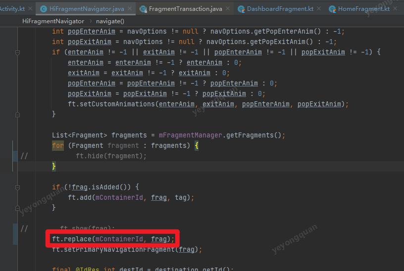
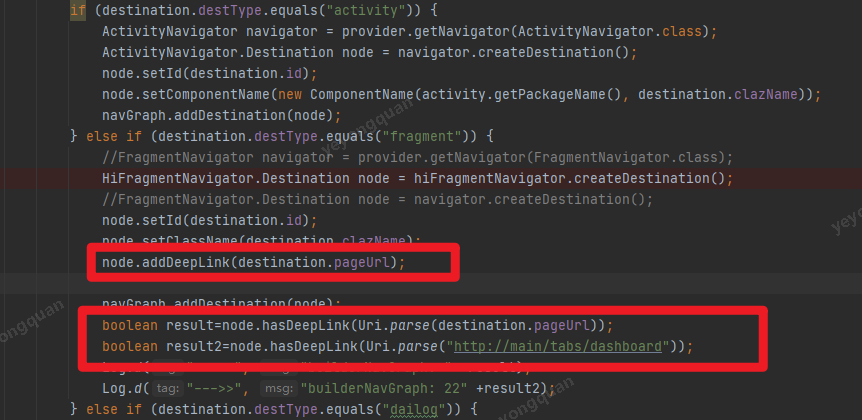
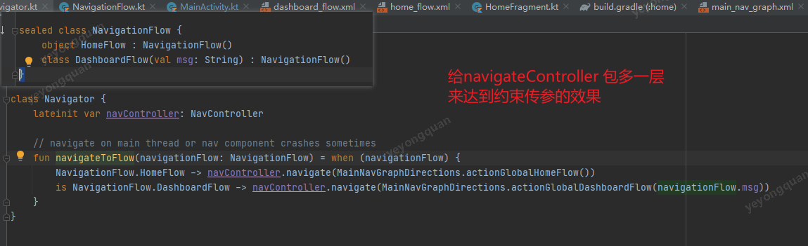
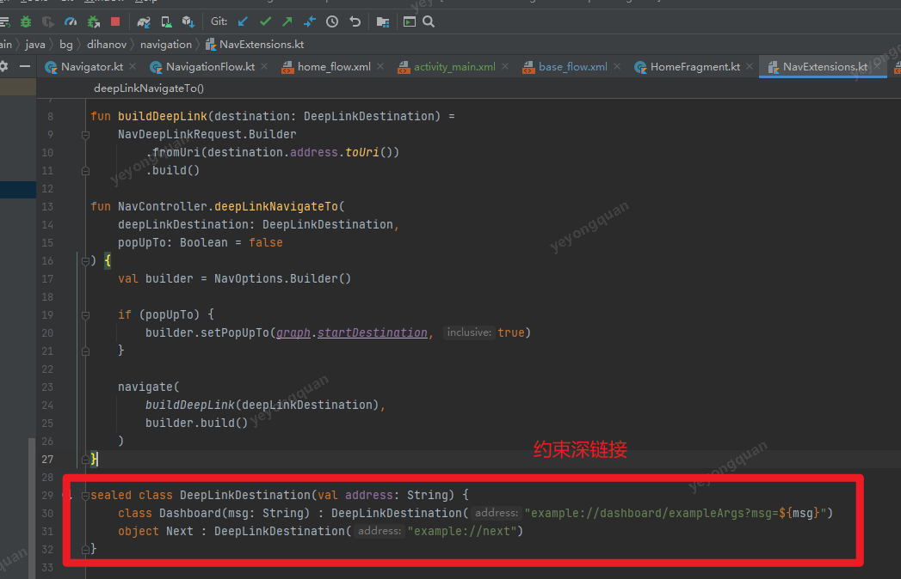

# navigation的生命周期


看源码



默认是 用 replace来做的。
所以说两次navigation启动起来的fragment不是同一个
fragment的生命周期会重新走。

不是同一个就会有个问题，界面上的临时数据不做处理的话，那么就会丢失。

如果把replace替换成  hide 和 show的话 就能避免重新创建，也不需要对临时数据进行额外的处理。


但是单纯的替换 成hide /show的话 是有问题的。
调用popBackStack的时候就会有fragment重叠的问题
如果要解决的话  还得处理fragment栈相关的处理。很麻烦。


自定义改造的话 还有一个好处。
那就是应该是可以用路由节点的方式来路由的 ，
但是如果用路由节点的话， 就没有栈管理信息了。比如
app:popUpTo=""//这种信息
实际上正常来说  同一个fragment中一个类型的fragment只要有一个fragment,无论是同一个实例或者是不同的实例。

暂时看来 为了把 复用fragment来改动FragmentNavigator的话，代价很大。 
暂时先不需要考虑 替换的问题。

但是假如说 不需要考虑popBackStack的话，通过自定义的那种形式 的确就可以实现复用，并且可以做到动态配置下发达到千人前面的效果。

所以常规需求的话，就用原生的navigation来处理吧。

tips

```
拓展 ：
Navigation能否通过路由节点 这样的方式来跳转呢？
感觉就类似深链接的方式

要是通过注解这种形式来处理的话
```



可以用类似路由跳转的， 但得加上http的前缀 没加前缀是不行的

但是想要灵活的控制 栈还是得额外的加代码才行

另外发现fragment重建还有个特性和fragment绑定的viewModel会被移除。


所以现在还是先用原生的来处理 就能满足需求了

# natigation的栈管理

navigation 默认情况下都是新创建fragment比如

A ->B->C->A
默认A 和A 是不一致的 ，而且 整个栈 就是A->B->C->A


```xml
//如果c->A配置了popUpTo  那么就是 A（old） ->A (new）
<action
            android:id="@+id/c"
            app:destination="@id/a"
            app:popUpTo="@+id/a"
            app:popUpToInclusive="false"/>


//如果c->A配置了 popUpToInclusive = true    那么就是剩下A (new）了
<action
            android:id="@+id/c"
            app:destination="@id/a"
            app:popUpTo="@+id/a"
            app:popUpToInclusive="false"/>
```


# 多模块navigation的方案


核心思路
用一个navigation module
里面 用假资源文件来声明  出完整的路由。
并且声明出  全局的action操作

其他用到fragment的module再去

依赖navigation的module。
全局的操作 navigationModule中已经实现 内部的操作内部自己搞就行

implementation project(":navigation")


另外可以在navigate module中包多一层 来约束全局操作的传参。
但是感觉不是特别的必要，因为并没有做到强约束。但是约束下 还是有点作用的。



navigation中不仅仅可以约束 全局操作。
还可以对深连接进行约束。

因为深链接也是全局性的操作。
这样就可以通过navigation module ，任意一个module都只可以直接跳到其他module的任意一个fragment了。
并且还可以用过popUpTo操作来控制栈



所以navigation的跨模块 是有方案可以支持的。

