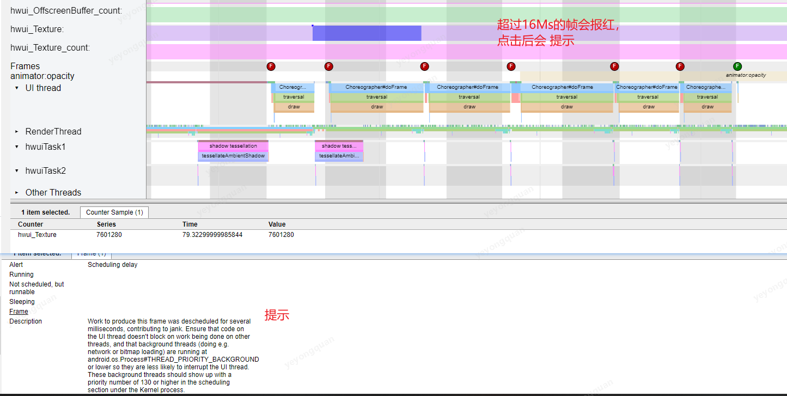

# 性能优化专题

## 启动优化

### 获取方法耗时

常规方案 ， 插入时间戳。
aop方案， 加入切点 。 分离监控代码和业务代码。

wall time , cpu time  的区别：
wall time 是程序执行的时间，  cpu time 是cpu执行这段代码所用的事件。
程序员能优化的是cput time 这段时间

### 异步初始化

常规异步  async Task , handler等， 不好处理 依赖管理。

用启动器 来管理启动认为，  类似于gradler 的task ，再task之间建立依赖关系。

### 延迟初始化

优化方案： 结合idleHandler 来延迟初始化，  避免ui卡顿。

### 提前异步类加载

在dex 加载后， 主动的用 Class.forName 去加载类。
避免业务起来后，再一次性的大量加载。

### 模拟面试

#### 你是怎么做启动优化的

首先先分析启动优化的需求的背景
然后做具体方案

- 需求背景
  当项目越来越复杂后， 发现一些初始化之间的依赖关系会导致一些bug的出现。

  必须一些任务得先从服务器查数据回来，
  一些得先到sdk的去查，再传给服务器。
  一些子进程的启动得先从主进程里去获取数据

  一些不是很紧要的初始化任务 ，比如地图 ,im， sip 注册啊这些 混杂在一起 比较混乱。

- 解决方案
  我们的解决思路分两个部分：
  1，用idelHandler去初始化 非紧急的初始化
  2, 用启动器来进行初始化，把初始化任务细化为一个个task ，类似gradle的编译那种逻辑，
  在task中建立依赖关系，从而达到了链式的去指定任务的之间的依赖关系，用启动器还有一个好处就是把初始化任务给标准化了， 加业务的时候，也有了标准。 维护起来更方便些。

#### 是怎么异步的， 遇到什么问题？

用常规的 线程池异步方案 的最大问题就是 对于一对多 或者多对一的依赖关系的时候 维护起来很麻烦， 而且代码逻辑很难看懂。

后来就把初始化任务分成了一个个独立task，然后维护住task之间的依赖关系后，再由线程池去驱动初始化， 这种构建出来的启动器代码维护起来会更加的方便，逻辑也很清晰。并且还能规范 后序业务的初始化的逻辑

#### 启动优化，有哪些容易忽略的注意点

- cpu  time 和 wall time的区别。
- 对延迟初始化的优化 ，idleHandler ,避免阻塞主线程
- 提前类加载， 在application attach 了context之后，就在子线程用class.ofname 去把class加载到内存当中。

#### 版本迭代导致的启动变慢有好的解决方式吗？

初始化的代码要标准化
初始化代码的改动 在合的时候  ，jenkins 会主动通知给大家。

## 内存优化

### 线上内存监控

常规方案：
选择时机， 执行dump，保存内存状态到文件当中。然后传回给日志系统。
然后拿着文件 分析。
缺点  文件大，没重点，效率很低。

LeakCanary方案：
需要预埋监控点 才行。
LeakCanary 会多次的去dump内存， 并且是把内存信息全部保存到内存当中，比较占内存 ，所以可能会OOM。
还会主动gc ，可能会影响到应用的性能

定制LeakCanary方案：
定制方向
预设怀疑点  -》 自动怀疑点（自动检测大内存对象） 在低内存的回调里面查当前activity的所占内存，如果大于阈值，那么就加入leakCanary的watch中
分析泄露慢 -》 只分析size大的文件
LeakCanary导致OOM -》 裁剪内存分析文件

### 优化大方向

#### 细节

打开 higtheap
在低内存回调中 ，主动的去回收内存， 必须清掉bitmap缓存 ，跳转回主界面
使用优化的集合类 ： 比如 SparseArray

谨慎使用SharePrefrence ，因为SharePrefrence 是全部读进内存里的

#### 内存泄露

需要有内存监控 比如 leakCanary。

#### 内存抖动

尽量不要在频繁被调用的函数里 ，或者递归里面去申请内存或者创建变量

#### BitMap

给bitmap的缓存空间不要特别大，要有回收机制 比如lru
对imageView进行hook 如果发现给imagerView设置了尺寸不合适的图片 ，得主动提示。

### 模拟面试

#### 你们内存优化是怎么做的

分析现状

日志系统 里OOm的概率比较高

分析发现，产品经常给应用配置了和ImageView尺寸不一致的大图。
我们就给ImageView加了 hook 当发现图片和imageView的尺寸差异比较大的时候就主动上报给日志系统。

另外 我们也尝试过把leakCanary 给带上 线上环境中，  发现leakCanary本身对性能影响比较大，就给停了。
看到别人的线上监控方案，基本上需要对leakCanary进行定制， 优化分析书读，和内存占用之后才带上线的,。不过我们并没有精力去做这个leakCanary的定制。

#### 做内存优化的最大感受是什么

在线下，对代码质量的管理能很好的解决线上的问题。
我们用jeaking 管理了提交的代码中，不允许有不被许可的warning.
加入这个管理之后， 明显各种bug少了许多。

并且用统一的环境进行出版本也能避免很多坑。
比如 一些字符编码导致脚本失效的问题。

## 布局加载优化

### android 布局加载原理

- 加载xml  这个是个io操作 ，io 操作是比较慢的
- 然后根据标签  通过设置的factory 或者反射来构建view
  反射 效率比较低

从上面两点来看， 布局加载的瓶颈点就有两个了, 读取layout的io 操作 和创建view时 是通过反射来完成的

#### LayoutInflater.Factory

这个是创建view的过程中的一个hook，
提供了用户定制创建View的过程的渠道

这个Factory最常规的场景就是  比如需要把TextView从系统默认的全局替换成自定义的

### 异步Infalter加载

AsyncLayoutInflater是用于异步加载的类。
主要是把 布局加载流程中的io操作和 反射操作都到子线程去执行 ，这样可以避免影响到主线程的响应。

要点

- 异步Infalter
  - WorkThread加载布局
  - 回到到主线程
  - 节约主线程时间

基础用法：

异步的得到 view 对象，然后再回调中去对view中操作.
AsyncLayoutInflater直接返回了 View对象， 这样就避免了在主线程中去执行io操作和反射操作了， 侧面优化了布局加载的速度

AsyncLayoutInflater的缺陷就是 不能自定义 Factory.
不过这点可以把 AsyncLayoutInflater拷贝出来， 然后重写一些来解决。

### 模拟面试

#### 在布局优化的时候 用到了哪些工具

choreographer : 拿到实时的帧率 ，可以带到线上。
aop  ： 切点获取耗时
Systrace ： 每帧的耗时
LayoutInspector: 分析界面的层级信息

#### 布局为什么会卡顿

加载流程说起 

-  io（布局加载里有io操作）,
-  反射（默认情况下 ，创建view是通过反射来创建的），  
-  遍历 ，重绘 （布局层级多的话，得多次绘制，耗时较多）

优化

- 异步inflater,（AsyncLayoutInflater  把io操作和反射操作放到子线程中去处理） 
- X2C （把xml 转成java类 ，减少了io操作）， 
- 减少层级(用相对布局来处理，stub 布局懒加载)，

#### 布局优化方面的成果产出

体系化的监控手段 : 线上加线下
指标 ： FPS ，加载时间，布局层级

## app卡顿优化

###   卡顿问题的排查的难点

- 原因多  代码/ 内存/ 绘制/ io
- 难复现

### 卡顿检测工具

- cpu  profiler 
- systrace
- strictMode

#### cpu profiler

[参考][https://developer.android.com/studio/profile/inspect-traces?hl=zh-cn]

信息详尽  但是性能消耗大，会影响app 本身的性能

#### Systrace

会生成xml 报告

systrace 怎么用
systrace.py -t 20 sched gfx view wm am app webview -a com.example.myapplication
 20是时间  com.example.myapplication是包名

可以用这个工具来分析 trace文件

https://ui.perfetto.dev/#!/

也可以直接打开

#### StrictMode

### 自动化卡顿检测方案

#### 原理

系统工具在线上不方便。
需要有线上监控方案来帮助监控卡顿和卡顿发生的场景

原理基于android的消息处理机制。

mLoggIng对象在每个message处理的前后被调用，通过分析mLogging来检测该消息执行时间是否过长

looper的logging是一个接口 ，而且是主动设置的

设置自定义的loggin

根据looper.loop里面的打印的头，就能区分出 消息执行的开始和结束了。

自动化监控的具体方案

#### AndroidPerformanceMonitor的使用

#### 问题以及优化

问题 ：卡顿信息不准确

因为堆栈信息是不是准确的在卡顿时进行收集的。
但是卡顿可能是在message执行的中途任意时刻发生的

优化：
在一个message执行的过程中，短间隔的多次收集，同时分析多个堆栈

通过排重 减少上报的堆栈信息的大小， 也方便开发人员进行排查

### ANR 分析

anr分类

#### 线下解决办法

 分析trace文件

#### 线上解决办法

对文件进行监控 FileOberver  ，如果这个文件发生变化，那么就说明有anr.但是android高版本是有权限问题的，这个访问就没法用了。

另一个方案是anr  watcher dog
原理：
一个子线程来 while循环 ， 每次循环都是主线程发个消息 让个变量加1；
然后子线程休眠一段时间 去读这个变量看是否被加1了 ，如果被加了就说明主线程执行了这个消息， 没有发生卡顿。
如果没有被加1 的话就说明 卡顿了， 很可能发生anr了。

#### Anr watchDog 和AndroidPerformanceMonitor的区别

Android PerformanceMonitor监控的是每一个msg
Anr watchDog监控的某个特定的msg是否被处理了。

### 界面秒开

用启动器延迟初始化，异步初始化
异步inflate , x2c (xml转成java文件)，绘制优化（用相对布局，用懒加载view）

#### 界面开启耗时

onCreate -> onWINDOWfOCUSchANGED

### 卡顿优化小结

- 把耗时操作给异步 或者延迟执行

- 布局优化： 异步inflater ,x2c , 重绘解决

- 内存 减少gc

  

#### 系统工具

systrace : cpu 使用情况 开销小
TraceView: 每个线程的使用情况， 但是开销大，会影响app本身
StrictMode:   

#### 自动化监控

AndroidPerformanceMonitor : 用高频采集， 过滤出重复堆栈，提高信息可用性。
ANR-WatchDog

### 卡顿优化模拟面试

#### 你是怎么处理卡顿优化的

背景：测试人员反馈卡顿的时候，有时是没有不能复现的。

所以重要的是要有一个指标去衡量是否卡顿。
但是卡顿不是anr 是没有系统文件分析的。

有个androidPreformanceMonitor的监控卡顿的方案，通过设置looper的logging对象去监控每个msg执行的耗时，可以通过这个耗时来给是否卡顿做一个量化指标。
这样就能根据日志里来判断是不是卡顿了。
感知到卡顿了之后 ，就可以去打印下当前的堆栈，从而来分析是卡在了哪里。
不过要注意的就是堆栈信息的收集的频率要高些，因为卡顿是一个持续的过程，只打结果那一下 是判断不出来的。

#### 自动化获取卡顿信息

loop中有个logging对象 在没有msg被处理之前和之后 都会执行 特定函数，
通过自定义logging对象并且设置给loop，就能达到监控卡顿的问题了

感知到了卡顿 也还需要把堆栈打出来 ，才能分析到原因。
不过打堆栈信息不是只打印一份就行了，而是需要高频的打印，找出重复率高的部分。
重复的这部分就是比较值得怀疑的点了。
毕竟卡顿是一个持续性的过程，只分析某个瞬间的话，有用信息比较少，可能耗时函数已经结束了。

#### 卡顿的一整套方案是怎么做的

线上线下结合

线下： 怀疑点处加hook （用lancet 或者epic来做都可以），观察单次执行的耗时，和被执行的次数是否正常。因为就算单次耗时短，但是也顶不住大量的重复执行。

线上：用自动化监测的方案来处理。
线上的卡顿分两种： 一种anr了  ，一种没anr
区别就是 一定时长内特定msg没有被执行，就可以认为是anr了，代表库有anr watch dog
另一种就是通过loop的logging对象去监控单次msg的执行耗时是否正常，代表库有AndroidPreformanceMonitor

## Android线程优化

### android 线程调度原理

在任意时刻 ，只有一个线程占用cpu ,处于运行状态
一般说的多线程并发，指的是轮流获取cpu的使用权

#### 线程调度模型：

轮流获取均分时间片/ 抢占式（获取）

android用的是抢占式

所以同时多开线程并不一定会提高效率， 有可能有些线程抢不到cpu的时间片

### 如何锁定线程的创建者

通过Hook来收敛入口
hook  thread的构造函数
在thread的构造函数里 打印一下调用堆栈就能看到这个thread是谁创建的了。

### 线程收敛

各个moduel ,用统一的线程入口来 执行线程。

### 线程优化模拟面试

#### 线程使用为什么会遇到问题

项目当中有些功能本身在多线程的情况下使用可能会有问题。
比如我们项目中就模拟adb 在多个线程下一起使用的话就有发生异常。
而且线程乱开的话，可能会导致主线程卡顿，或者异步任务由于线程一直拿不到时间片而非常耗时。
所以收敛下线程，能对程序的预期更清晰些。

#### 怎么在项目中对线程进行优化

- 通过hook thread的构造函数，来打印堆栈， 从而能追踪thread的创建者
- 统一线程入口 收敛线程
- 区分任务， 对IO密集型和 cpu密集型做区分
  io密集型的线程池就核心数就可以大一些，因为不太发生cpu相互抢占导致的效率变低
  而cpu密集型的任务核心数就不要超过 cpu的核心数了

## 网络优化

#### 维度

- 流量
- 质量

先主要关注质量

#### 质量优化

##### Http请求的过程

- dns 域名解析成ip
- 创建连接   三次握手建立连接

dns 优化   
使用HttpDns 绕过运营商   
HttpDns
不是像DNS 一样像dns 服务器的53端口发请求，
而是发送一个http请求 到DNS的80端口 。
好处 ：绕过运营商dns的劫持

Http协议自身的优化

1.0 tcp 不复用
每次都要三次握手

1.1  tcp连接默认不关闭
不需要每次都进行tcp的三次握手了

但是每次通讯的数据都得按顺序来

2.0   不再是超文本传输协议了， 而是2进制协议 
支持多工  ，也就是客户端和服务器可以通过一个tcp连接同时进行多个请求的通讯。

质量的监控
对OKhttpClient设置监听回调就可以 对网络的各个流程进行监听了。

## 电量优化

## 专项优化

### 列表页卡顿优化

常规优化

- 对viewHodler进行绑定处理，复用contentView, 避免多次执行findViewById

- 耗时任务 异步执行

布局相关：

- 减少布局层级 ，避免过度绘制
- 异步inflate 或者X2C  来加载

图片相关：

- 避免过大尺寸， gc 频繁， 内存抖动
- 滑动时 取消图片加载 ，只有用户在停止的时候才加载用户需要的图片

线程相关

- 使用线程池收敛线程，减低非UI线程的优先级，避免主线程的时间片被抢占

TextView相关优化

- 对于原生的TextView ，面对复杂的文本时性能不佳。可能会导致卡顿。
  TextView内部是根据情况来选择Layout来加载的
  BoringLayout 单行
  StaticLayout 多行
  DymincLayout 可编辑

  可以直接使用faceBook的TextViewBuilder来优化

### 存储优化

SharePreferences的优化
Sp 的特点：

- 加载慢   初始化是 加载整个文件
- 全量写入 单次改动都会导致整体写入
- 卡顿 补偿策略导致 系统会发广播让sp 保存，由于sp是执行在主线程当中的，所以保存操作会阻塞主线程的

优化 ：
  sp的替代   腾讯的 MMKV 
mmkv :
 支持 增量写入
支持从sp中迁移数据

#### 日志存储

常规

- 每产生一个日志 就写一遍到磁盘  不丢失，但是性能损耗
- 开辟一个buffer缓存， 等到一定大小后，再存文件， 可能会丢日志。

优化方案 
mMap  
内存映射文件,   系统会自动回写 内存数据到磁盘当中。
优点： 日志不会丢， 减少了io操作。

业界实现： Xlog , Logan

### WebView异常监控

白屏检测 看webview 当前的bitmap 的像素点是否都为和第一个像素一样

腾讯开源了一个轻量级的webview

性能问题

https://tech.meituan.com/2017/06/09/webviewperf.html
优化方案：

- webview启动是需要启动浏览器内核的， 全局公用同一个webview就能避免多次初始化，从而减少启动浏览器内核的次数，加速启动。
- 初始化的同时 ，通过native去完成网络请求， 使得网络请求和浏览器内核启动并行处理
  （对于客户端来说就是给webview 注入个函数给webview来调用。）
- 自己想的 白屏检测  ，然后加载本地的html
- 对于特定资源请求， 可以做拦截， 用本地的返回回去。

