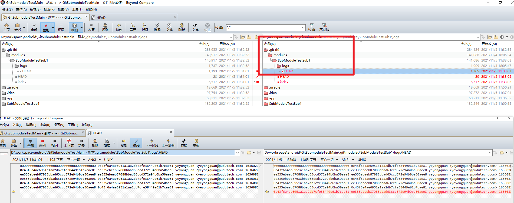
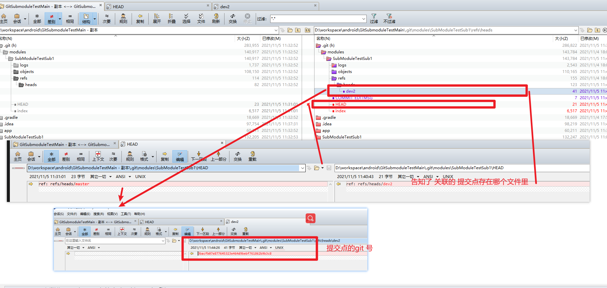

怎么更新子module

直接切到主module的目标分支
然后在主module下
执行

git  submodule init // 如果没有init的话就执行次，init过的话就不执行了。

git submodule update

主module和submodule怎么关联的。

在主module切一下分支 就会有本地记录，
这个本地记录在.git / modules/submodule_name/
中。
里面记录的是 提交的 git号。

所以说 要感知的当前的关联就得把.git 中的信息上传上去才行
否则远端是感知不到的。

