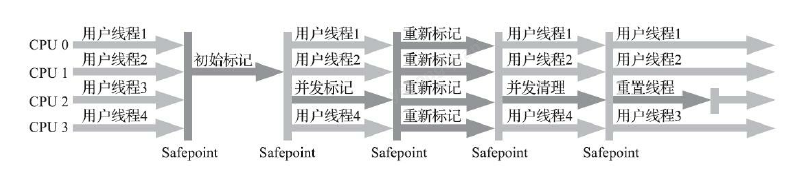
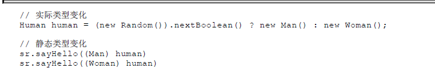

# JVM


## 内存


### jvm对象


#### 对象的创建

当jvm 遇到  字节码new指令时 会有以下行为

1. 检查这个指令的参数 能否 在常量池中 这个类的符号引用

2. 判断这个类是否已经被加载 ，解析，初始化过，没有则做对应处理

3. 类检查通过后，虚拟机在java堆中为新生对象分配内存
   对象所需的内存大小，在类加载时就可以完全确定，

   （jvm的内存管理，在jvm规范中并未做强约束，可以配置，但是内存管理一般和GC策略是配套的）

4. jvm 分配好内存后，会对对象进行必要的设置，比如锁状态，该对象是哪个类的实例，怎么找到类的元数据，GC的分代信息等等；

5. 执行完以上四步之后，从jvm的角度  对象已经产生的了。但是从开发者的角度，对象还未完成。因为其构造函数还未被执行（Class文件中的init函数还未被执行）
   变量的初始化也还未做；
   对象的初始化的执行和 对象的创建本身没有关联。
   new之所以可以触发对象的初始化，是因为在字节码中
   new的命令后面会有invoke指令，这条指令才是触发对象的初始化的。
   但是如果是其他的方式 创建的对象，则可能不会触发对象的初始化。
   完成初始化之后， 一个可用的对象就创建完毕了。

#### 对象的内存布局

分三个部分：

- 对象头
- 实例数据
- 对齐填充

对象头中主要存储的是一些标志位
主要就是锁的状态 和GC的状态


#### 对象的访问定位

java程序 是通过 一个在栈上的引用来操作在堆中的对象实例的。
jvm规范中 并没有规定 引用要怎么定位到 堆中的实例。

HotSpot 虚拟机中用的是  引用类型直接存 堆中实例的地址。


### OOM

#### Java堆溢出

OOM 异常，  会跟着java heap  space 的提示


发生java堆的OOM的时候 就需要 判断是内存泄漏 引起的，
如果不是内存泄漏，那么就要考虑提高jvm的堆参数（ -Xmx 与-Xms 设置），或者优化程序的逻辑，减少内存的消耗

#### 虚拟机栈，本地方法栈溢出


hotspot 是不区分  虚拟机栈和本地方法栈的
栈容量只能用 -Xss来指定

jvm规范中 描述了两种异常

- 线程请求的栈的深度大于虚拟机所允许的最大深度，那么就报stackOverflowError
- 虚拟机允许栈动态扩容，当栈申请不到内存时，就抛出OOM 异常

hotspot 是不允许栈动态扩容的，所以在hotspot中，栈的溢出，一定是报stackOverflowError的。
hotspot 允许 设置java堆的内存最大值和方法区的内存最大值，那么栈的容量就是  
系统限制内存 - java堆内存  - 方法区内存 - 程序计数器内存

程序计数器的内存很小， 基本可以忽略。


#### 方法区、常量池溢出

jvm运行时常量池是方法区的一部分，所以内存的限制是一致的。

hotspot在jdk7之前都是在用 永久代在实现方法区，7之后就移植到元空间来实现了。

永久代是在java堆中的参与gc的，元空间 我感觉可以理解成是独立于jvm java堆的。

这可以用方法区溢出来测试 虚拟机是把方法区放在永久代中，还是放在元空间中。
如果是在永久代中的话，那么就应该和堆溢出报一样的错误。
OOM +java heap space

测试方法：

创建很多字符串

实际结果如下


提示的是permgen space 而不是 heap space

所以说 hotspot 的确是把方法区 移植到元空间当中了。

#### 本机直接内存溢出

操作系统 的实际内存不够用时，也是报OOM，
但是会发现堆栈信息很短，如果程序使用了直接内存的话，就可以往这方面考虑了。


## GC


java内存模型中， 程序计数器，虚拟机栈，本地方法栈 3个区域随线程而生，随着线程而灭，这三个区域是自动管理的，不需要GC去维护。
而Java堆和方法区这两个区域则有着很明显的不确定性，只有程序运行时，我们才能知道程序究竟需要多少内存，
这部分内存就需要动态回收。GC关注的也就是这部分内存。

```
疑问：
方法区也能回收吗？
和堆一样回收？
```


### 对象已死？

怎么确定对象是否需要回收呢？
前面说到 ，对象实例 的头部是有 GC的标志位的。
这个标志位就是给GC来分辨是否需要回收的。

#### 引用计数法

对象实例中添加一个引用计数，当对象被引用了就+1，
引用销毁就-1； 根据引用计数是否为 0 来判断是否被引用。

缺陷：
单纯的引用计数法 没法解决 ，循环引用的问题
例如下面的代码


#### 可达性分析

通过GC Roots 的根对象作为起始节点集合，从这些节点开始，根据引用关系向下搜索，搜索过程走过的路径称为引用链。如果某个对象到GC Roots之间没有引用链的话，那么就说明不可达。（本质就是图论的不可达）


在jvm中 ，固定可作为GC Roots的对象包括以下几种：

- 在虚拟机栈中的引用对象，也就是各个线程中的局部变量，临时变量
- 在本地方法（native）栈中引用的对象
- 在方法区的静态属性引用的对象
- 常量池引用的对象， 比如字符串常量池中的引用
- 虚拟机内部的引用 ，比如一些常驻异常对象
- 所有被同步锁持有的对象
- 还有一些GC策略自定义的对象
  比如一些具有局部回收能力的GC算法（如G1 等） ，就需要配合一些GC自定义对象作为Roots才能保证 算法的正确

#### 引用的类型

强引用(默认)：只在判定为未被引用被回收
软引用： 在将发生内存溢出时，GC会把软引用列为2次回收目标，无论是否被引用着都会进行回收
弱引用： gc扫描到就进行回收
虚引用：一个对象是否有虚引用，不影响其生命周期，虚引用也无法获取到对象实例， 虚引用的意义只在与这个对象在被回收时 收到一个系统通知。

#### finalize

在被GC 判定为 不可达（死亡）的时候 对象实例是有一次干预的机会的。
如果finalize被重写的话，那么该对象会被放入一个队列中，并且会被jvm专门为该队列创建 的线程中去执行里面对象的finalize函数。
如果想不给gc清楚的话，可以在finalize中 添加上 可达性关系，就可以避免被清除。
但是这个专属线程 优先级很低，如果finalize函数很重的话，会影响到整个队列的对象的回收。

这个函数只会被执行一次，如果第二次被标记为不可达，那么jvm会认为finalize已经被执行过，不会再执行了。

这个finalize 开发基本不要用。
有人认为 java 设置这个finalize只是 java诞生时为了迎合C++工程师而设计的（用来对齐C++的析构函数）


但是这个finalize 就说明了以下现象：
对象是可以由 不可达状态  变为 可达状态的。

这样的话 ，那就得从新理解cms的算法了。


#### 方法区的回收


jvm规范中 提到 不要求 虚拟机在方法区中实现垃圾收集。但是并不是要求不对方法区进行回收。

方法区的回收主要是两个部分：

- 废弃的常量
- 不再使用的类型

废弃的常量

常量怎么被判定为 没有被引用呢？
常量不是作为 GC Roots吗？


不再使用的类型

这个条件就很苛刻了


这个正常是不需要回收的，但是hotspot还是提供了控制方法。
一些大量使用反射的框架会有频繁的自定义类加载器的场景，这时通常就需要jvm有自动卸载类信息的能力，以此来减少方法区的内存压力。


### GC算法

现在的垃圾回收算法基本都采用了分代回收
分代回收是建立在下面两个分代假说之上的：


但是实际上  对象并不是孤立的，对象之间会存在跨代的引用。这个跨代引用 影响回收吗？
感觉也不影响回收呀？

这段话 不太理解，  新生代老年代和GC Roots有啥关系？
GC  Roots应该只和标记过程有关。
而且标记也应该是全部对象都要关心的呀？
感觉 深入理解jvm一书里的意思是：
老年代的一些较老的对象，可能就不会被 栈等其他常规GC Roots引用着，而是成为了一个独立的GC Root.
不太理解。如果常规的GC Roots 引用不到 这个古老对象的话，程序怎么用的到他呢？

hotspot的实现上，可达性分析的时候是不分  老年代还是新生代的。
但是 当可达性分析到达老年代的区域的时候，就会主动中断链路。这样就不需要对老年代做处理的了。

这样的处理可以大大的提高了gc的效率（基于上面的假说是的），因为老年代回收率很低。
但是这样又引出了新的问题，那就是老年代对象引用着新生代对象 的时候，由于gc roots链在老年代时就断开了，这个新生代对象 会被误认为是该回收的。这怎么办？

这时候 就需要下面这条假说来做理论支撑了。


也就是 跨代引用只占少数，并且随着年龄的增加，会变成同代引用。

这时hotspot是通过 在老年代中划分区域来处理的。
分成了 可能存在跨代引用的 ，和不考虑跨代引用两个区域。
然后把可能存在跨代引用的区域加入到GC Roots中。
这样在上面的三条假说下 ，就能避免误差新生代对象。

回收的时候 对新生代和老年代的处理不一样。

标记-清除 ： 基础， 但现在已被废弃，
优点 ：由于对象地址没有改变 所以不需要 stw ，
缺陷 碎片太多
标记-复制 ： 现在对新生代基本都是使用这种算法
优点： 对于要回收的对象多的时候 效率很高
缺陷 ：需要浪费 一部分内存
标记-整理 ： 对老年代基本都是这样算法
缺陷：  整理的速度比较慢

也有些策略是 标记-清除 和标记-整理  来综合处理。

标记-复制 和标记-整理 这两种策略 都涉及到 对象地址的改变，所以都是要有stw的

#### GC的时间点

前面说了 gc是要有stw的。
这个线程的挂起是怎么触发的呢?
是线程 不断的轮训gc标志来自动挂起的。
但是在hotspot中，线程的挂起并不是随时都可以的。
而是要在安全点、安全区域中才能挂起，安全点的概念后面会讲。

​

### HotSpot的算法细节

#### 安全点，安全区域

迄今为止，所有的GC 在GC Roots的枚举这点上都是必须暂停用户线程的。也就是stw.如果不stw的话，那么就无法保证gc  roots的可靠性。

hotspot 设计了个数据结构 使得能够 直接得到当前的对象的引用，这样能够使得 gc roots的收集更快速度。
但是多了记录的内存开销。
内存开销又带来了另外一个问题，如何平衡 其内存开销和可靠性。
如果不是每条指令都增加记录的话，就不能保证准确，因为不能保证线程停下的指令有记录。
所以jvm对线程设计了安全点的概念，也就是说jvm的线程不是想停就停的，而是必须停在安全点中， 这个安全点会记录下，对象的引用信息。

hotspot 通过安全点的设计来 保证 在进入gc的roots收集的时候信息是可靠的。
但是实际上 单安全点的设计并不能适应所有的情况，因为有可能线程到不了安全点，就被停住了。（比如sleep ）.
hotspot 就设计了安全区域的概念，可以说是 安全点的拉伸。
当用户线程执行到安全区域时，就会改变相应的标志位。
离开安全区域的时候也会改变相应的标志位。

#### 记忆集、卡表


记忆集是 用于记录从非收集区指向收集区域的指针集合的抽象数据结构。

应用于  GC  时 新生代被老年代引用着的情况。


#### 标记的并发的可行性分析


见三色标记法


这里有点不明白。

按照这个分类，那么就是一次扫描完成就是会对要GC Roots的全部对象都扫描过一遍了。
如果扫描过程中，引用关系发生变化， 那又要重新扫描.
那这样效率不是很低？
具体的 回收时机 应该是和  具体的GC 的实现相关联的。


解决对象消失问题有两个方案：

- 增量更新 ：  一个黑色标记引用 白色标记时， 黑色变为灰色， 应用于cms
- 原始快照：

### 经典垃圾回收器

这里先要搞清楚一点。
并不是jvm只使用一种垃圾回收器的
而是使用 垃圾回收器的组合。
甚至是内存的不同状态 jvm都会采用不同的gc

一般是对新生代 的回收用一种，对老年代用一种
但是最新 的G1 回收期 ，是可以做到跨代回收的。


前面提出了个疑问， 垃圾回收器的回收的节点是什么时候？
这个就是每一种垃圾回收器都不一样了。
下面对具体的垃圾回收器做分析。

#### Serial

用于新生代回收

回收方式： 标记 - 复制算法

回收过程：在gc的整个过程中，单线程执行 ，并且是stw的，标记完后直接复制。

优点： 管理简单，内存开销小
缺点：  stw的时间很长


#### ParNew

Serial的改进版
改进的地方是 在回收的过程中 由单线程执行改为了 多线程执行。

#### Parallel Scavenge

和parNew 类似， 但是其加入了些自动的提高吞吐量的动态调整

#### Serial Old

和serial 类似。
但是用的是 标记- 整理 算法。

用于处理老年代


#### CMS

现在最成熟的GC。
用于老年代的gc处理。

采用 ： 标记 - 清除的算法

做到了 标记和清除分布的处理。
做到了不需要在整个gc过程中都stw
比前面介绍的gc算法的耗时更低。

下面分析下 cms 算法 中 需要stw的阶段，以及 进行清除的时刻。

cms 的工作分为 一下几步：

1. 初始标记
2. 并发标记
3. 重新标记
4. 并发清除

过程如下



初始标记

需要stw,只处理gc  roots直接引用到的对象

并发标记
不需要stw,在这个过程中，引用关系有可能会有变化。
这些变化会被记录下来，到 重新标记的阶段再处理。
记录的是 不可达变可达的情况。

也就是标记的并发的可行性分析中说的一样，
黑色 引用了 本该被回收的白色之后， 会变成灰色。
并且在remark阶段重新测算。

重新标记


需要stw,
这个 重新标记的阶段是在做什么？
是在把 可达的 修正为不可达的 ，
还是说 在把不可达的  修正为可达的？
亦或是两者都有？
根据 标记的并发的可行性分析章节可知道，remark做的是把不可达的修正为可达的。
这点也是必须做的。
深入jvm 书中并未提高remark 有修正 可达变不可达的情况。
并且还特地说 可达变不可达 不是必要的。
所以推测 remark阶段  只做了 不可达变可达。

这样的话， 很多内容都说通了。


清理

清理是不需要stw的，因为要处理的是那些已经认为不可达的对象了，并且也乜有涉及到存活对象的地址的移动。


cms的缺陷

- 对cpu资源敏感， cpu资源紧张时 会影响到 用户线程的性能

- 用的是标记-清除算法 ，会有内存碎片 ，会提高触发full -gc的频率
- CMS  无法处理浮动垃圾

这里主要解释 无法处理浮动垃圾这个点.
因为 并发阶段  用户线程是一直在进行的，所以cms并不能阻止垃圾的不断的产生，也就是初始标志之后，原本存活的对象实际已经不可达了。但是remark也并未对这种 可达变不可达做修正，所以说cms 无法处理 在并发标记过程中产生了浮动垃圾
本次的gc并不能回收掉这部分的垃圾，需要等待下次gc再回收。


#### G1

复杂的一批 ，只要知道 G1是把堆分为了一小块一小块来分治处理， 打破了 新生代回收和老年代回收的边际即可。

#### 低延迟GC - Shenandoah,ZGC

复杂 先不管。


## 类文件结构

### class结构

可以用010editor 来打开 class文件。
也可以用javap -verbose 命令来解析

class 结构

javap -verbose的输出


constant_pool 是各种类型的描述。
但是所有constant_pool的描述都是基于uft8的
比如method


- 魔数

- 常量池 （ count 比实际要多1 ，多的1表示空常量池用2个字节来表示， 所以说 一个常量池的最大长度是65535）

- 访问标志

- 类索引，父类索引 ，接口索引

- 变量表（field_info） 变量信息长度是一样

  

- 方法集合    方法信息长度是不一样
  由常规信息和代码信息组成。
  方法的长度使用两个字节来存储的，
  也就65535.
  这个很可能就是 android中 dex的65535的限制的由来。

- 属性表集合这个是属性 ，不是变量。给的信息比如说的 源文件像下图给的就是源文件
  


### 字节码指令

#### 加载，存储

1. 将一个局部变量加载到操作栈
   指令：x_load
2. 将一个数值从操作数栈存储到局部变量表
   指令： x_store
3. 将一个常量加载到操作数栈
   指令： x_push, ldc_x,x_const_x

说明局部变量的名称不会存到局部变量表中的。
而是以序号来处理


这里也能说明， 局部变量 最多也是只有65535个。
另外也就说明 局部变量的命名是不受长度约束的。


如果是 成员变量的话，那就有问题的了。


#### 运算

1. 加  
   指令：x_add
2. 减
   指令：x_sub
3. 乘法
   指令：x_mul
4. 除
   指令：x_dib
5. 求余
   指令：x_rem
6. 取反
   指令： x_neg
7. 位移
   指令： x_shr
8. 位或
   指令：x_or
9. 位与
   指令： x_and
10. 位异或
    指令：x_xor
11. 自增
    指令：x_inc
12. 比较
    指令：x_cmp_x

#### 类型转换

指令 ： x_2_x

#### 对象创建和访问

1. 创建类实例： new

2. 创建数据：
   new_x_array

3. 访问类字段

   getfileld， pushfileld，getstatic,putstatic

4. 把一个数组元素加载到操作数栈

   x_aload

5. 把一个元素赋值给数组
   x_astore

6. 获取数组长度的指令
   arraylength

7. 检查类实例类型的指令：
   instanceof,checksast

#### 操作数栈管理

操作数栈的体现


也就是说字节码的指令都是伴随着操作数栈的处理的。

操作数栈相关指令：

1. 操作数出栈
   pop,pop2
2. 复制栈顶数值，重新压入
   dup_x
3. 栈最顶两个数值互换：
   swap


#### 控制转移指令

功能：有条件或无条件的指定要执行的下一条指令

1. 条件分支
2. 复合条件分支
3. 无条件分支（强制跳转）


#### 方法调用和返回指令

调用：
invoke_x
返回：
x_return (返回值类型由返回指令来指定)

#### 异常处理指令

指令;athrow

#### 同步指令

之前就了解到 java的同步 syncnize 是通过c++的monitor来完成的。字节码中的同步指令 用的就是monitor关键字

指令：
monitorenter
monitorexit


## 类加载机制

前面已经讲了 class的文件结构。
接下来讲 jvm是怎么把class文件加载到内存当中的。

### 类的生命周期


加载->连接 ->初始化 ->存活-> 卸载
连接时就会做验证，准备，解析。

#### 类加载的时机

1. 遇到 new ,getstatic,putstatic,invokestatic这四条字节码指令时;
   也就是new对象，或者访问其静态变量或静态函数时。
   对于静态变量有例外，如果是flnal的静态变量，访问时不会触发类加载。
   因为final staic的常量是在编译期就加载到常量池中了，就不会涉及到类的访问。
2. 当类在初始化时，发现其父类还未进行过初始化的话，则需要先触发父类的初始化
3. 反射调用
4. 当执行类的初始化的时候，发现没有被加载那就加载
5. jdk 8 之后接口允许有默认实现，如果接口有默认是实现的话，当接口实现类加载前会先对接口进行初始化

#### 类加载的具体行为


可以看出，jvm规范中并没有规定类的二进制字节流从哪里来，并不要求一定是磁盘中。
所以android中是有动态下发字节流这种处理的。

加载最终的结果就是 jvm的方法区中有了代表这个类的类信息的class对象。

#### 验证

- 能否被当前虚拟机处理？
- 语义分析是否符合java语言规范
- 语义是否有能被检测出来的危害

#### 准备

为静态变量分配内存，并且分配初始值。
这个初始值不是代码里的初始值，代码里的初始值需要到 类加载的初始化的阶段 cinit函数被执行的时候，才处理的。

所以感觉准备阶段最重要的是给静态变量分配内存

#### 解析阶段

把jvm常量池中的符号引用替换为直接引用。
也就是说 常量池中如果有一些静态变量发符号引用（也就是字符串信息），就直接替换成加载到内存后的直接引用。


#### 初始化阶段

字节码中的clinit函数被执行。
clinit函数里面就是 静态代码块，变量初始化 的赋值等

### 类加载器

#### 双亲委派模型


### jvm虚拟机字节码的执行

#### 栈帧

java虚拟机以方法作为最基本的执行单元，栈帧 是用于支持虚拟机进行方法调用和方法执行背后的数据结构。

栈帧存储了方法的局部变量表，操作数栈，动态链接和方法返回地址等信息。
一个栈帧需要多少内存是在编译时就确定了的。
一个方法的调用链可能会很长，从程序的角度看，在调用堆栈中的所有方法都同时处于执行状态。
但是对于执行引擎来说只有 栈顶的栈帧还是生效的。


##### 局部变量表

局部变量表示一组变量值的存储空间

局部变量表的容量以变量槽为最小单位。


局部变量 是以序号来存储的。
是不存变量名称的。
函数的局部变量的最大容量在class字节码文件中就有标明。
就是函数信息的 max_locals

一般变量槽的长度是 用32位（对于64位机，会补齐成64位），除了double和long之外都是占用一个变量槽，double和long是占两个变量槽。

如果执行的不是静态函数的话，局部变量表的第一个变量槽存的是方法所属对象实例的引用（由this调用）。


局部变量也是可以被替代的。用大括号来施加作用域。

一个奇怪的现象


在上图的基础上 加了一个无意义的操作缺导致了内存的回收。


原因是 图一种 该引用的局部变量槽没有被复用。
但是实际编程中不需要这样些，因为现在的编译期基本都做了处理。第一种方式就能正确回收。

##### 操作数栈

一个栈结构。
随着字节码指令出入数据。
栈的虽大深度在class字节码文件中有标明
就是函数信息中的max_stack 字段

在概念模型当中 ，两个不同的栈帧作为不同函数的的元素，应该是完全独立的。
但是实际上虚拟机为了优化性能，是有可能有重叠区域的。这样可以避免数据的传递（因为调用栈中，是很可能有传参的）


##### 动态代理

分析class文件的时候 知道 class文件的常量池 存有大量的符号引用，jvm在方法调用的时候就会替换成为类加载完成后具体地址的直接引用


##### 方法返回地址

当一个方法开始执行后，只有两种方式退出这个方法。

- 执行引擎遇到任意一个方法返回的字节码指令
  返回就返回给到上一个栈帧，也就是上个函数。
- 产生了异常 ，执行了athrow指令


无论何种退出方式，在方法退出之后，都必须返回到最初方法被调用时的位置，程序才能继续执行。
一般来说，方法正常退出时，主调方法的PC计数器的值就可以作为返回地址。
理论上，方法退出的过程

1. 当前栈帧出栈
2. 恢复上层方法的局部变量表和操作数栈（恢复的意思应该就是把本栈帧的影响给消除，不知道局部变量表存储的位置）
3. 把返回值压入操作数栈中
4. 调整PC计数器的值 指向调用指令的后一条指令

##### 附加信息

​	jvm规范中 并未明确 需要加啥信息。
一般是具体jvm加入调试，性能分析相关信息。


#### 方法调用

​	方法调用不等于方法执行，
​	方法调用的唯一任务就是确定被调用的方法的版本（即调用哪一个方法）。

##### 方法解析

前面说到 类加载的解析阶段会讲其中的一部分符号引用转化为直接引用。这种解析能够成立的前提是：方法在程序真正运行之前就有一个可确定的调用版本，并且这个方法的调用版本在运行期间是不可变的

类加载的时候，对于静态方法和私有方法都是不可能通过重载，继承或者别的方式有其他版本的。
所以类加载完成时就能对 其静态方法和私有方法替换其符号引用。

这时引出了一个概念：虚方法。
类加载时 能直接替换其符号引用的 就叫非虚方法
反之则叫 虚方法。

非虚方法有：

1. 静态方法

2. 私有方法

3. 实例构造器 clinit 函数

4. final 修饰的 方法

5. 父类方法


为啥 父类方法 是非虚的呢？

先要搞清楚 符号引用替换成直接引用是啥意思？
是谁在替换？
是替换内存中其他已经加载进来的class对象中的符号引用，
还是替换自己本身的符号引用

感觉上应该是只对被加载类做替换。如果加载过程中涉及到别的类的话，那么就先加载这些类。
然后把被加载类的符号引用（包括引用的是别的类）替换成直接引用。

按照这个理解，再结合父类方法是非虚的说法。
应该说是 加载该类前会先加载父类，父类方法的非虚方法会进行符号引用的替换。 也就是说 父类的非虚方法才是非虚的。

##### 方法分派

在java中方法的分派的体现主要是重载和重写，
java的重载和重写是怎么实现的？

###### 静态分派 -  重载

由于java的多态的属性，可以把变量的类型 分为

- 静态类型
- 实际类型

区别是静态类型在编译程序的阶段就已经确定了，但是实际类型编译期并不知道。

有点难理解，但是可以分析下面的代码。




human变量 的实际类型 只有到运行期才能知道是man还是woman,但是编译期间就确认了其静态类型是human.

后面对human进行 强转，就又改变了变量的静态类型。
虽然改变的静态类型，但是在编译期还是能确定其静态类型的。

了解了 静态类型和实际类型 的概念之后，再回到方法的分派。
运行时方法的分派完全取决于传入的参数的数量和数据类型。
jvm在分派时是以静态类型来判断。
前面的非虚函数 之所以能有非虚的特性，原因也是调用是其静态类型和实际类型一定是统一的

```
ps：
现在有A,B 两个接口
对象C 同时实现了 A，B两个接口，

这里有个对象D，
对象D 有  fun(A) fun(B)

如果实例c去执行fun 会怎么样呢? 
fun(C)

事实上，编译期在编译时可能会包语义有歧义的错误不给通过，
但是jvm的规范中并没有对这种情况约束。
如果绕过了编译报错的话，
实际执行中jvm是不保证 fun（C）是执行fun(A)还是fun(B)，但是是一定能被执行的。
```


###### 动态分派 - 重写

同一个方法（同函数名，同参数类型），父子类之间有多种实现。
方法分派的时候 是用 静态类型分派 还是 实际类型分派呢？
从结果来看就是用实际类型分派。

具体的分派 得从jvm规范入手。
jvm对invokeVirtual 指令运行过程大致分为以下几步：

1. 找到操作数栈的栈顶元素所指对象C （也就是操作数栈的第一个元素时该函数的所属对象）
2. 如果在类型C中找到与常量中的描述符和简单名称都相符的方法，那就校验访问权限，如果无权限则报IllegalAccessError
3. 在C中没有找到，那么就在父类中从下往上的找
4. 都没找到就报abstractMethodError

class文件中是只保留了直接父类信息的。
所以在找函数实现的时候 一层一层的往上找是比较合理的。


注意 函数 有 虚 和非虚函数之分，但是字段是没有这个概念的。

在有同名字段时，jvm的查找是按照


这里有个不太明白的地方。
为啥父类的构造函数中调用的是子类的重写函数呢？


看看字节码：


从字节码来看，子类的确就是指明了调父类的 init。

那就是同样的字节码，但是运行出了不一样的结果。
那就要从栈帧环境 入手了。

字节码中看出  父类init函数中用的是invokeVirtual来调用 函数。

回顾下 invokeVirtual 的步骤


第一步是 操作数栈的  函数所属对象。
感觉就是这个问题的核心就这里。|

子类的 调用 父类的init用的是 invokeSpecial，
也就是非虚的， 可以直接取到指针地址。
而父类init中调用的重写的函数 用的是invokeVirtual.

所以在调用这个重写函数的时候的栈帧里的 操作数栈的所属对象就是这个invokeVirtual 要去哪里找函数的关键。

从结果上来看， 这个操作数栈的 所属一定是 new出来的那个对象实例。
也就是说

```
Father f = new Father(); // father的init的操作数栈的所属元素就是 father的实例
Son s = new Son(); // father的init的操作数栈的所属元素就是 son的实例

```

由于所属实例的不同，所以同样的字节码会有不同的表现。
这样也就解释了 为什么 父类构造函数里调用的是子类的重写函数。

从上也能得出：
invokeSpecial 和invokeVirtual的区别。
invokeSpecila是不受函数操作栈影响的，
invokeVirtual是受函数操作数栈的所属对象影响的，其决定了从哪开始找对应的虚函数。

这里也侧面巩固了 虚函数 和非虚函数的概念。
虚函数 是需要 配合 操作数栈 才能确定，非虚函数是全局唯一的。

###### 动态分派的实现

jvm在实现时为了优化函数分派的效率，对虚函数就不是一层一层的往上找的了。
而是建立了一个虚方法表。直接指向的 函数地址。
没有重写父类的就 和父类的表保持一致，重写了的就指向自己重写的方法。

#### 动态类型语言支持

啥是动态语言？

举例子
obj.println("    ");

加入这一行java代码  ，那么obj 必须是声明的类型或者其子类，并且该类型中有println函数 才能执行。 这就是静态类型语言的特质。
而如果是JS 代码的话， 只需要要求obj的实际类型中有这个println函数 就能执行。无论其具体是啥类型的。这就是动态语言的特质。

java有这个限制的 核心原因就是
字节码中 已经将  完整的符号引用生成出来的


java 为了支持 动态语言特性，就避免了编译时就固化了类型到class文件。
而是提供了新的接口来达到动态确定类型的目的。
用法如下， 用法很像反射。
就是具体的类型得需要运行时才能确定


这里说下  上面的函数句柄 和反射的区别。
反射是在模拟java层方法调用， 而函数句柄是在模拟字节码的调用。
反射可以跳过 函数的权限约束， 但是字节码不行。

但是用法上来说 感觉没啥区别。


jdk7 是 更新了 字节码指令。
加了一条invokeDynamic  ,  目的也是为了扩展java的动态语言的支持的能力。

invokeDynamic主要是给其他语言使用的，java使用的很少。
用jdk7中javac 甚至都没有办法生成出 invokeDynamic的指令。
invokeDynamic的指令的原理和 函数句柄类似。
invokeDynamic需要三个参数 ： 引导方法 ， 方法类型 ， 方法名称
例如：


```
猜测：kotlin的传函数 用的就是 invokeDynamic来实现的。
```


动态语言特性在java 语言当中的应用。

如果一个子类要调用父类的父类方法怎么处理呢？
感觉有点难搞，
但在jdlk7之后 通过 函数句柄的方式 就方便一些。
但是发现在android中和java中有区别。


用书中的例子 在下面跑 调用的不是祖父的函数。


#### 基于栈的字节码解释执行引擎

下面基于jvm的概念模型来分析执行过程。
但是概念模型并不是 虚拟机实现的真实流程，因为虚拟机做了各种各样的优化，
但是优化之后的结果和概念模型的结果是一致的。

##### 解释执行

在jdk 1.0  时  java 可以说是 解释执行的 语言。

但是随着主流虚拟机当中都包含了即时编译器之后，class文件中的代码到底是解释执行还是编译执行就成了由虚拟机自己决定的事情了。

也就是jvm虚拟机  对 字节码 直接解释成机器码 还是对字节再做一层翻译处理之后再生成机器码这个由虚拟机自己把握。


##### 基于栈的指令集 与 基于寄存器的指令集

先要搞清楚一点  最终cpu处理的是 01的机器码。
不是指令集， 无论是 基于栈的还是 寄存器的。
我理解的是 java 字节码所用的指令集是基于栈的。
但是说不定也有别的跨平台的语言是基于指令集来实现的。

tips：现在的32位的8086体系的处理器 提供了 8个32位的寄存器， arm v6体系的提供了30个32位的通用寄存器。
用寄存器指令集的话 ，跨平台就不太好做了。起码编译器就分平台了。

比对一下 字节码的指令和  寄存器指令（以X86为例子）

以 1+1 为例子

java 字节码


x86


mov 指令把 eax 寄存器 置为1 ，
add 对eax 寄存器的值 +1；计算的结果也就是在eax寄存器当中。


栈架构的指令集    和 寄存器的指令的对比

栈架构下会更频繁的 内存访问（大量的 入栈 出栈），也会比寄存器指令多出些额外的指令。
栈架构 语义更加紧凑，
栈架构  由于内存访问多和 指令更多 所以栈架构要慢与寄存器架构


##### 基于栈的解释器的执行过程

指令的参数 都存在栈中， 会有大量的入栈 出栈的操作。


### 程序编译与代码优化

java中 编译的概念很泛。
下面这些都是编译

1. java -》 class
2. 运行期 字节码 转本地机器码
3. 程序编译成与目标机器指令集相关的二进制代码

#### 字节码编译 -javac

javac是作用于java ->class阶段的

分为如下步骤：

1. 解析与填充符号表
2. 注解处理器‘
3. 语义分析 与 字节码生成


#### 语法糖优化

##### 泛型

java 的泛型是类型擦除的。
泛型 是不参与到对象的实际类型信息的。

但是类的全部 泛型信息是以一个字符串的形式记录在 class文件当中的。
运行时可以通过反射获取。


由于java的类型擦除  所以java有如下限制


java的泛型的类型擦除 后 只是在元素的访问和修改时 自动插入了 一些强制的**类型转换**和检查命令。

这强制类型转换就有问题了。
对于 长度不同的数据 是没法强转的。
比如 long 和int之间就没法强转的。

java是怎么处理的呢？
既然 长度不对的就没法强转， 那么就用一个对应的引用类型来包装成对应的长度一致的。也就是装箱 和拆箱。
个人认为  java的装箱和拆箱的引入 就是配合泛型的实现的。


再提一个  java这种设计的使用时的缺陷

下面方法需要传入一个 泛型的class,
如果 list有元素的话 ， 可以用对象实例来获取class，但是list可能会没有实例的。

```java
    public static <T> T[] convert(List<T> list, Class<T> tClass){
        if(list.size()>0){
            T[] arraya = (T[])Array.newInstance(list.get(0).getClass(),200);
            return arraya;

        }
        T[] arraya = (T[])Array.newInstance(tClass,list.size());
        return arraya;
    }

```

##### 自动装箱

自动装箱要注意

Integer a = 1 ;

Integer b = 1 ;

Integer c = 257 ;

Integer d = 257 ;

a == b  是true
c==d   是false

原因是 jvm的常量池内嵌了256以下的装箱类型
所以装箱的值的判断还是得用value


#### 即时编译器

当虚拟机发现某个代码块运行的很频繁的时候 ，在运行时虚拟机就会把这些代码编译成本地机器码，不再需要经过解释器的解释执行，并对这段本地机器码进行各种优化，比如合并操作呀等等。（也就是因为这些优化 导致了一些比较少见的bug， 比如 程序乱序执行得用voltail关键字等）


问题
编成机器码能够提高效率 ，为啥不全编成机器码呢？

有两点考虑

- 启动时间会变长
- 内存占用大量增加

如果运行时全编译成机器码，那么就会有android 6.0应用安装是那个问题。
就是安转时间非常长。
到jvm这就是 启动时间非常长。


现在最主流的jvm hotspot 用的就是 解释器和 编译期同时并存的运行架构。
这种架构的好处就是
启动时只有 解释器生效，  启动比较快， 运行中编译器开始工作 性能得到会逐渐优化，
被编译器的优化后的代码块不是运行中永久存在的，是有可能被逆优化返回成字节码给解释器执行的

#### 提前编译器

应用场景 android的ART。
也就是 在运行前就把字节码全部翻译成机器码，然后再执行。


## 高效并发

### Java内存模型与线程

物理内存模型


java内存模型


java 内存模型规定了所有的变量都存储在主内存中，每条线程还有自己的工作内存（类似物理上的高速缓存）。
线程的工作内存中保存了被该线程使用的变量的主内存的副本，线程对变量的所有操作都必须在工作内存中进行，而不能直接读写主内存中的数据。
不同的线程之间也无法直接访问对方工作内存中的变量，线程件变量值的传递均需要通过主内存来完成。

注意 ： java的内存模型和 实际的物理结构没有绝对的对应关系。
java的工作内存 虚拟机一般会尽量用    寄存器或者高速缓存来存储

#### jvm内存间交互

java内存模型中定义了 一下8种原子操作（实际上对于 某些平台上的double 和long 类型来说 是允许有例外的 ）：

lock :  作用于主内存的变量， 它把一个变量标识为一条线程独占的状态
unlock:  作用于主内存的变量，把一个变量从 线程独占状态释放出来，释放了之后 才允许被重新标识为独占状态
read: 作用于 主内存的变量，把一个变量的值从主内存传输到线程的工作内存当中，以便 随后的load 动作使用。
load: 作用于工作内存，把前面read进来的值，读进变量的副本当中
use: 作用于工作内存，把工作内存中的变量的副本的值传递给执行引擎
assign:作用于工作内存，把执行引擎的值付给工作内存中的变量副本中
store:作用于工作内存， 把工作内存中一个变量的值传送到主内存当中，以便后续的wirte操作使用
wirte:作用于主内存的变量，把store操作从工作内存中得到的变量的值放入主内存中

另外 jvm规范中规定了

1. 要把一个变量拷贝到工作内存中， 那么就要按顺序 执行 read和load
   要把一个变量同步回主内存就要按顺序执行 store ，wirte;
   但是中间是允许插入别的指令的。

2. 不允许 read和load , store和write 单独出现

3. 不允许线程丢弃它最近的assign操作，也就是变量在工作内存中改变了之后，必须把该变化同步回主内存中。

4. 不允许工作内存中的变量 不经过assign操作就 同步回 主内存中

5. 一个新的变量只能在主内存中诞生，也就是说use和store操作之前一定共有assignhe load操作。

6. 一个变量在同一个时刻只允许一条线程对其进行lock操作，但lock操作可以被同一个线程重复执行多次， 但是 lock和unlock一致时，变量才会解锁

7. 如果对一个变量进行lock操作，那么就会清空工作内存中此变量的值，需要重新assign,load;(应该是只清空执行lock操作的线程的工作内存)

8. unlock只能对 已经被lock了的变量操作

9. unlock之前要先把 工作内存中的 变量 同步回主内存中


#### 对于volatil型变量的规则

当一个变量被定义成了volatile之后，它将具有两项特性：

- 保证此变量对所有线程都是可见的 ，可见的意思是所有线程都能立刻得知该变量的改变
  对于立即可见的理解 并不是会立刻同步到其他的工作内存中，而是工作内存中的每次使用都会到主内存中进行刷新，线程的执行引擎看不到不一致的情况；
  但是由于volatile变量的运算并不是一定原子性的，所以在并发的情况下，还是会有线程不安全的情况
- 禁止重排序
  cpu对明显无依赖的指令可能会在执行中乱序处理， 这种乱序处理的处理结果在同一个cpu中 仍然是有序的，但是在高并发下缺有可能会发生错误。
  volatile的变量在赋值时， 汇编代码中对插入一个需要依赖前面结果lock语句来避免cpu的重排序

从内存交互指令的角度来看 volatile变量的规则：
T ： 一个线程
V,W：分别表示两个volatile变量

- 只有当T 对V执行的前一个动作是 load的时候 ，才能对V执行use
  只有当T 对V执行的后一个动作是 use的时候，才能对执行load
  也就是可以认为对于volatile 变量来说  read  load use是连续且一起出现的
  这条规则 就是每次使用都要 刷新

- 只有当T对V执行的前一个动作是assign的时候，才能对V执行store
  只有当T对V执行的后一个动作是store的时候，才能对V执行assign
  也就是可以认为对于 volatile 变量来说 assign , store，write是连续且一起出现的
  这条规则 就要求 工作内存中的副本的每次变动都要同步到主内存中

- 假定
  动作A 是T对V 实施 use， 或者 assign动作
  动作F是和动作A关联的load, 或者store动作
  动作P是和动作F关联的read ,或者write动作

  动作B 是T对W 实施 use， 或者 assign动作
  动作G是和动作B关联的load, 或者store动作
  动作Q是和动作G关联的read ,或者write动作

  如果A 先与B ，那么P 必定先与Q
  这个规则要求volatile修饰的变量不会被重排序。
  这么说来这个重排序是volatile变量之间的
  也就是汇编代码中  
  a - lock -b -lock
  A 和B 的过程中都是可以乱序的， 但是 a 和b 是有序的。
  一定是a 先与b 执行完成

#### 原子性，可见性与有序性

java的内存模型是围绕着病发过程中如何处理原子性，可见性和有序性这三个特征来建立的。

原子性：
内存模型中 规定 变量的 read load  use assign  store write都是原				子性的 （虽然在32位的虚拟机中对 double和long可能物理上不是				原子的，但是逻辑上还是可以认为是原子的）
虚拟机 是没有直接提供 lock和unlock，但是提供了更高层次的字				节码指令
monitor enter 和monitor exit 来隐式调用。
monitor的指令 对应到 应用程序 就是synchronnize 关键字
也就是可以认为synchronize是原子性操作
这里一定要搞清楚，被lock的变量只是不能被别的线程lock,别的线程读写都是可以的

可见性：
就是volatile的特性，  但是除了 volatile之外 还有  synchronize，和final能提供这种可见性。

volatile的可见性的保证 前面已经说过了.
synchronize 的可见性 是通过  unlock前要把 变量同步回 主内存， lock前要清空工作内存中的拷贝         
final  的变量 变量的所需对象 this 未传递出去 切被初始化的时候 那么其他线程就能看到final字段的值。

有序性：
volatile 和synchronize  都有提供有序性的保护。但是实现的手段是不一样的。
synchronize是通过 变量不能被多个线程同时lock来保证 两个lock-unlock块操作的先后顺序
而volatile 使用的是 插入了汇编代码  对前序结果有强依赖，来避免cpu对指令进行优化


对变量操作lock  unlock的理解。

```java
		

        Thread thread1 = new Thread(new Runnable() {
            @Override
            public void run() {
                long count =100000;
                int tmp = 0 ;
                int num = 0 ;
                synchronized (a) {
                    tmp = AA.count;
                }
                while(count>0) {
                    count--;
                    synchronized (a) {
                        AA.count++;
                        if(AA.count- tmp>1){
                            num++;
                            //System.out.println("TAG"+ "result  run: count  AA.count- tmp>1  " + AA.count+"  tmp  "+tmp);
                        }
                        tmp = AA.count;
                    }
                }
               System.out.println("TAG"+"result   num  thread1 "+num);
            }
        });
		thread1.start();
       Thread thread2=  new Thread(new Runnable() {
            @Override
            public void run() {
                long count =100000;
                int tmp = 0 ;
				 int num = 0 ;
                synchronized (a) {
                    tmp = AA.count;
                }
                while(count>0) {
                    count--;
                    AA.count ++;
					  if(AA.count- tmp>1){
                        num++;
						
                    }
                    tmp = AA.count;
                }
				  System.out.println("TAG"+"result   num  thread2 "+num);
            }
        });
		thread2.start();

		try {
            thread1.join();
            thread2.join();
        } catch (InterruptedException e) {
            e.printStackTrace();
        }
        System.out.println("TAG"+ "result " + AA.count);
		
```

给出5次 执行结果


如果  线程一直用 工作内存的数据拷贝的话， 那么 num都应该是 0。

从上面的测试结果看出来，对象被lock后  read 还是会对主内存中去同步的。
并不是一直使用工作内存中的拷贝的。

上面可以发现 synchronize 的同步次数要比 非synchronize的要多很多。
这也侧面验证了这条规则
lock前要清空工作内存中的数据拷贝


#### 先行发生原则

如果说要用volatile  和synchronize 来保证 指令的有序的话， 那么 代码会变的很啰嗦
实际上java的编程 是有一个  先行发生 原则的。

先行发生原则：
如果操作A  先与 操作B 发生，那么操作A的产生的影响能被操作B观察到。


```
tips:
cpu做 指令的乱序的时候，是操作B 肯定是 不关系操作A 的结果，才能被乱序执行的。
```


#### Java与线程

java线程Thread的api 基本都是native。 所以基本可以确定 thread的具体实现时和平台相关的。

所以java的thread 是平台的通用实现， 不是java的定制实现。

下面就基于 通用的实现 来分析线程.
实现线程 有三种方式：

1. 内核线程
2. 用户线程
3. 使用用户线程+轻量化进程的混合实现

##### java线程的实现

jvm规范当中 并没有 规定 线程实现方式

主流的虚拟机用的都是 全内核线程
以hotspot 为例子， 它的每一个java线程都是直接映射到一个操作系统原生线程来实现的。
而且中间没有额外间接结构，hotspot 自己是不会去干涉线程调度的,可以设置线程的优先级给操作系统， 但是具体的处理是全权交给操作系统的。


##### Java线程调度

线程调度是指系统为线程分配处理器使用权的过程，调度主要方式有两种：

- 协同式
- 抢占式

协同式 是需要线程自己主动释放
抢占式 是由系统来分配时间 线程的切换与否由系统决定

jvm 用的都是抢占式的


##### 线程状态转换

java语音定义了 6种线程的状态
一个线程只能有其中一种状态， 并可以通过特定方法来完成状态的转换。

- 新建： 创建后 尚未启动
- 运行： 包括操作系统的ready和run，也就是可能正在被执行，也可能正在等待操作系统为其分配时间片
- 无限期等待：  放弃操作系统分配时间片的要求，需要被其他线程显式的唤醒
  比如wait  join函数
- 有限期等待：  放弃时间片， 一定时间后 系统自动唤醒 ， 比如 sleep
- 阻塞：     由于对象被lock  线程无法继续执行 知道对象被unlock之后 才能继续执行
- 结束：   已终止线程的的线程状态

线程转换关系图


##### java与协程


java线程的局限性
现在的java服务为了应对更大的访问量和处理更复杂的业务，对于一个外部业务请求，往往需要分布在不同机器上的大量服务来协作完成。
这就要求每一个服务都处理大量的请求， 缩短了每一个服务的响应时间。
之前 大量业务在同一个服务中处理时， 服务中的线程切换导致的开销在整个响应中 可以认为是微乎其微， 但是当架构变为微服务 的分布式架构之后，那么每一个微服务的线程切换的开销在本就极短的响应时间中 就显的有些突出了。

对kotlin的学习 已经知道 kotlin通过 suspend 修饰符来达到了协程的目的。
kotlin中在jvm上协程的实现手段是 通过 回调的方式来实现的。

切换线程的主要开销 是 响应终端，保护现场和恢复现场的成本。

操作系统最开始的多线程支持 调用视同的的是 协同式的方式：此时的多线程又被称为了协程。感觉是不是可以直接理解成 协同式调用的多线程就是协程呢？
从kotlin中协程的用法来看， 逻辑上来看好像是的。
协程要避免线程的状态切换的开销的话， 那么就需要自己在应用中去实现调用栈， 调用器这部分内容。也就是要自己维护工作状态。


##### java对协程的解决方案

纤程 ： 一种特殊的有栈协程。

loom项目现在正在实现，但是还未正式启动。
loom 中的纤程是完全独立的java库，是不依赖jvm的

kotlin的协程解决方案也是一个出路。


### 线程安全与锁优化

变量的线程安全  是对于多线程下的访问来说的。


#### 线程安全的实现方法

##### 互斥同步

也就是java中的synchronize  的 重度锁。
也就是对变量的 lock 和 unlock操作（对应待字节码就是monitor enter ，monitor exit），

线程的阻塞和唤醒都需要操作系统来完成， 这就不可避免的 陷入了用户态到核心态的状态转换之中，也就涉及到了线程切换的开销。

在jdk5之后 ，对于synchronize ,jvm实际上是有做优化的， 偏向锁-》轻量级锁 -》 自旋锁 -》 互斥锁


##### 非阻塞同步

前面的阻塞同步 是一种悲观的同步模型，
他认为 不阻塞就一定会产生问题。

实际上，并不是所有场景都需要阻塞的。

现代的处理器中新增了一条CAS 处理器指令， 这条指令就是 非阻塞同步的基础。


cas 指令有三个操作数 ： 内存位置 ,预期值 ，新值。
只有当 内存位置的值 为预期值时，才会把内存位置设置为新值。

##### 无同步方案

不需要做同步，线程各自用各自的。
比如说 ThreadLocal. 这种

#### 锁的优化


##### 自旋锁与自适应自旋

自旋锁是为了应对 锁被占用时间很短的场景而实现的。
用自旋锁 能避免 线程在用户态和核心态之间切换的开销，但是会浪费cpu的算力。

jvm中 对自旋锁的自旋测试默认是10次 十次之后就会用传统的互斥锁去挂起线程了。

实际上从jdk6开始对自旋锁 做了一些自适应操作，
jvm在运行时 是有对 自旋获取锁的可能 做计算的。
如果一个锁 通过自旋获取的频率很高， 那么jvm可能会增加该锁的自旋次数。
如果一个锁 通过自旋获取的频率很低，那么jvm可能就直接跳过自旋，直接用互斥锁

##### 锁的消除

锁消除 是指 虚拟机及时编译时 发现这个锁 ，不可能存在数据竞争的话， 就可以当中栈中的数据来处理。就不再进行锁的处理。
这个是否存在数据竞争是通过逃逸分析技术来实现的。

这里有可问题：
即时编译期分析出了 不需要锁，  那为啥字节码中会有锁呢？
是程序员的失误吗？
实际上，加锁的操作不一定是程序员做的。
如下


StringBuffer 是线程安全的， 但是由于sb对象 是不可能被其他线程引用的
所以不对stringBuffer加锁也不会有问题。
当jvm 解释执行的时候， 就会加锁，但是当jvm即时编译执行的时候就会自动优化做锁消除。
这就是个锁消除的场景。

##### 锁的粗化

正常来说 ，一般都是要求锁的范围越小 越好；
但是对于一部分连续操作 ，要频繁了加锁， 比如在 循环当中 ，那么即使没有线程竞争也会有大量的性能损失（频繁的 lock ,unlock），因此锁的粗化，减少锁的状态的改变，反而能够提高代码运行的效率。

##### 轻量级锁

轻量级锁是jdk6引入的。

前面分析对象的内存存储的时候 就知道对象存储的时候会有头部空间，这个头部空间主要用于存储 对象的锁状态 和gc状态。
这里的对象头的锁状态就是轻量级和偏向锁的标志位。

轻量级锁的过程

当代码即将进入同步块的时候，如果同步对象没有被锁定个，那么虚拟机首先将在当前线程线程的栈帧中建立一个 锁记录的数据结构， 同于存储锁对象的对象头的拷贝（也就是恢复数据的时候用的。）
然后用cas操作把 对象头的内容替换成 锁记录这个数据结构的地址。再把对象头的锁状态标志修改为轻量级锁。

当对象被置为 轻量级锁时，  又遇到锁的请求的话 会直接比对锁记录的地址，如果一致就直接为获取了锁；如果不一致的话，就说明有锁的竞争，然后就会自旋一定次数，自旋完成之后 还是没有拿到锁的话 ，轻量级锁就膨化成重量级锁了，后面等待锁的线程必须进入阻塞状态

##### 偏向锁

偏向锁也是jdk6引入的。
其目的是消除无竞争下的同步源语。

所以说轻量级锁时把 互斥锁 优化成了cas指令的话，那么偏向锁就是连cas指令都不做了。

当jvm启动了偏向锁的话（默认是启动的），当锁对象第一次被获取的时候， 虚拟机会把
对象头中的偏向位给置为1， 然后用cas指令 把原本存储 hash的位置改为存储线程id.
如果说对象的hash已经被计算出来了（对象的hash是在被调用时才填入的），那么就无法进入偏向态。当偏向锁状态下 被执行计算hash时， 也会直接膨化成重量级锁。

一旦出现另一个线程去尝试获取这个锁的情况， 那么偏向锁就会立刻撤销，撤销后标志位恢复到未锁定或者轻量级锁定。
后续的同步操作就按照上面介绍的轻量级锁那样去执行。
这里不懂。
偏向锁 遇到竞争就 升级成轻量级锁，
轻量级说 遇到竞争就升级成重量级
偏向锁升级的时候 竞争不是还在吗？
那不是轻量级就接着膨化了， 那哪还有轻量级锁的意义？
有意义。

请看下图。

也就是说轻量级锁的时候 ，后申请锁的线程 还有自旋一定次数的操作来尝试获取锁。

