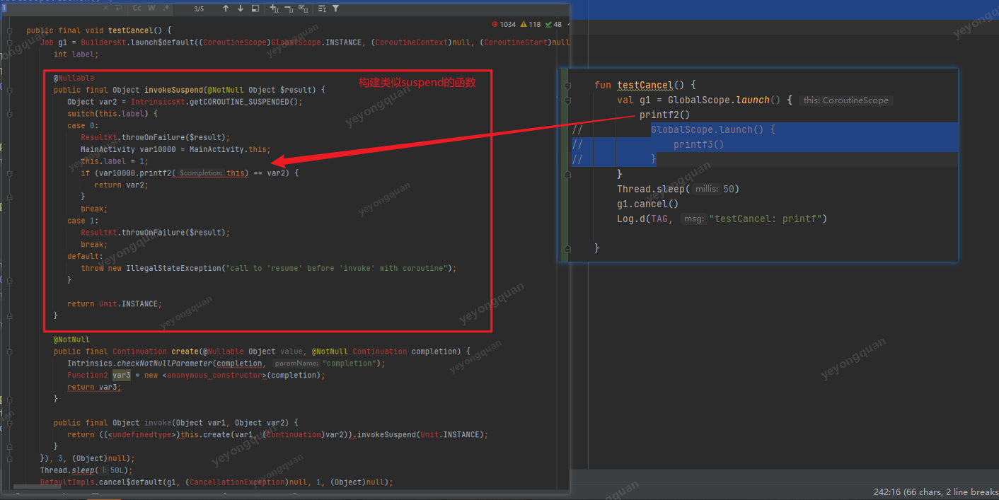

# 协程


## 协程是干嘛的

官方表述 协程是轻量级的线程

从用法上来说 感觉就是用来切换线程的。
其优势就是可以用同步的写法，来写异步的代码。

特点：
协程是运行在用户态的，既然不是内核态的 那么就不是cpu直接控制的。

切线程是怎么切的？  

suspend 起什么作用？

scope 能做什么？

scope嵌套怎么处理的？

## 协程的启动模式

- DEFAULT 立刻启动，但是是否执行取决于调度器
- LAZY  被需要时才启动，也就是 job的start或者await执行时才启动
- ATOMIC   一般用不上  只有在cancel的是否有区别，在被启动之前是不能被取消的
- UNDISPATCHED  和外部在同一个线程中执行


## 协程的调度


从接口看来有点像个Map

看下存储的Element是写啥
随便看两个， 发现都是和线程有关系的东西。
这时可以大胆推断 scope的目的就是


看看scope这个map里面 具体存的element有哪些？


协程的一些信息也是element

要注意Element是继承了CoroutineContext的。 也就是任意一个 element 都是context  也就是都可以做launch函数的第一个参数。

所以element应该是协程相关的信息。

调度器也是通过element存进来的。
比如说  这个Dispatchers.Mian   就是element 的一种


 所以说 scope就是一个存储着协程相关信息的集合，并不是啥特别的东西。

分析下常用的 scope的context

- Dispatchers.Main
  
  前面看过 就是用handler去分发消息

- Disapatchers.DEFAULT
  

- Dispastchers.IO
  实际就是个阻塞队列加 线程池

  

- Dispastchers.Unconfined

  


这里留意下 下面这个element

ContinuationInterceptor


jvm下的kotlin协程实际上就是通过回调 来处理异步的返回的。
continuation 就是回调的接口。

ContinuationInterceptor 就是回调的拦截器。
线程的切换等操作就通过拦截器来完成

先大概有的印象先


### 拦截器处理

自定义一个拦截器


这个处理过程就类似责任链模式

//这个例子中 看到了有 context+ context的情况


看了context对 +操作的重载可以发现 ，其实是把 map给合并了。  所以才有了context +context这种操作的出现


### 异常处理

前面说jvm协程的本质是回调。
那回调一般都是有 onSuccess /onFailure的

但是协程里好像没有看到失败的回调。

想要处理失败的话，可以给suspend包多一层来处理。

外边包一层suspendCoroutine 然后用 continuation来抛出异常

```kotlin


    suspend fun  testException(name:String) = suspendCoroutine<Any> {
        continuation ->
        //....逻辑
        // 抛出异常
        continuation.resumeWithException(IllegalStateException(""))
    }

```

实际上 continuation的扩展函数resumeWithException实际上也就是resumeWith


这里面的continuation是怎么获取到的呢？

这里就需要看 suspend这个关键字了。

先来看个现象。
因为java里面是没有suspend这个关键字的。
来看看java中调用kt的suspend函数会怎么样。

可以看出 java中调用会比在kt中调用多了一个continutaion的参数。


字节码处也确认了这个信息


所以可以推断出来 ，suspend 中的continuation参数都是从外部传入的。
这个continuation的参数就相当于传入了一个回调。
对调的结果在Result内部


前面看出协程的失败回调就是用exception来处理的，那么用trycatch 来捕获异常即可。
kotlin协程中还有一个很重要的特性。就是try catch跨了suspend 函数就不行了。
要是跨了suspend的话，那么就得通过ExceptionHandler来捕获

但实际上kotlin的设计并不需要总是用try - catch来捕获。

可以传入用于捕获异常的 continuation来完成捕获

用try-catch 可能捕获不到  resumeWith里的exception ,但是用CoroutineExceptionHandler 就可以捕获的到


所以说 使用coroutineExceptionHandler才是 正确的处理方式

这个launch这样处理就ok了。
但是async怎么处理呢？
因为async是需要一个返回值的

#### async


#### 嵌套


再加一层嵌套


### 取消与异常

具体在哪cancel得通过isActive标志位来处理

如果是同一个scope的话， 那么就父协程的cancel 同时能影响


如果嵌套里有scope那么 父协程cancel是影响不到子协程的


所以只要不加scope那么父scope都可以处理。

虽然同样是 GlobalScope,但是两次使用就不一样的。
如果就是scope内部的集合起到的管理作用。


协程的异常处理。
协程的默认关系是 协同关系， 也就是任一协程抛出异常就会取消整个协程体。
如果不想要子协程的异常影响到父协程和兄弟协程的话， 那么就需要用superVisorScope来指定 为主从关系

supervisorScope//主从作用域
coroutinueScope// 继承外部作用域  在suspend 函数中能使用


异常分派的 superVisorScope的用法


接下来探究下 supervisorJob的实现
为什么用了supervisorJob之后 就可以阻止 异常的传递呢？


取消的回调

```kotlin
取消协程 
协程被取消后 的回调 用这个 continuation来处理
suspendCancellableCoroutine

协程被取消的 资源释放啥的 可以在这里来做
```


用法：


### 挂起原理


从这两个例子就看出来了，suspend  函数是给编译器来确定回调的次数的。
kotlin在jvm的协程就是通过回调加状态机 来确定每次回调要执行的函数

每次回调的返回值是 getCOROUTINE_SUSPENDED的话 就执行挂起。
如果不是挂起的话，那么就是返回结果。


用反编译看 嵌套的情况

从下图可以分析出， 子协程收不收父协程的影响，就取决于子协程传入的context的对象




## KT字节码分析


先从 最简单的情况开始分析

```kotlin
import kotlinx.coroutines.*


fun main() {
    var job = GlobalScope.launch(Dispatchers.Default,CoroutineStart.DEFAULT) {
    }
    job.cancel()

}
```

对应的字节码

main 函数


从上面的字节码分析可以看出 上面的关键点是

1. 编译期自动创建了一个接口类， 这个接口类 是就我们些的函数类型的对应的接口的实现
2. scope执行了launch方法，并且把 前面创建的接口类传了进去

这里就分析一下，创建函数类型的接口的具体实现

协程这里的 函数类型 和 ，普通的函数类型是有差异的。

协程的 是继承的 Suspend Lambda 这个类的


SuspendLambda的实现 看不啥内容。


launch函数 就不分析了，这里着重分析 编译期生成的类

编译期生成的函数接口类 有下面的函数

```
public final invokeSuspend(Ljava/lang/Object;)Ljava/lang/Object;//  SuspendLambda 的抽象函数

public final create(Ljava/lang/Object;Lkotlin/coroutines/Continuation;)Lkotlin/coroutines/Continuation;/ 重写 suspendLambda的方法

public final invoke(Ljava/lang/Object;Ljava/lang/Object;)Ljava/lang/Object;// 函数变量 接口方法
  
```


invokeSuspend 


create 


invoke


可以看出 这个编译期创建出的类 最重要的就是其invokeSuspend函数。

接下来在协程代码中增加个打印

```kotlin
fun main() {
    var job = GlobalScope.launch(Dispatchers.Default,CoroutineStart.DEFAULT) {
        println("123")
    }
    job.cancel()
}
```


看出来就是 如果 invokeSuspend的labels是0的时候就会执行函数内的代码。


再修改下 协程代码
加个嵌套

```kotlin
fun main() {
    var job = GlobalScope.launch(Dispatchers.Default,CoroutineStart.DEFAULT) {
        async {
            println("1")
        }
    }
    job.cancel()

}
```

这种嵌套 编译器会 创建两个 接口类


这两个接口类的 invokeSuspend如下


再增加些代码

```kotlin
fun main() {
    var job = GlobalScope.launch(Dispatchers.Default,CoroutineStart.DEFAULT) {
        GlobalScope.async { // 给内部的协程加入一个 GlobalScope
            println("1")
        }
        println("2")
    }
    job.cancel()
}
```


用加了scope的 字节码（左） 和没有加的字节码（右）做个比较


本质都是调用 BuilderKT.async ，但是前面入栈的元素不一样。

加了scope的，就接着用指定的。
没有加scope的  用的 TestKT$main$job$1.L$0

看起来就是 外部协程的返回值job的一个成员变量
的确是的


简单的话说就是调用async的第一个scope 参数是不一样的，这个很可能就是外部job.cancel能不能影响到嵌套再内部的协程的原因所在


反编译出来的java代码 更加直观，就是 传的参数不一样


所以说到底还是传的context的原因。

并且并不是都传Global就行。


async 是 scope的扩展函数。
根据前面的字节码和反编译出的信息可以看出，scope是参数之一，
没有带scope的 默认是带上层scope的成员变量。

看看调用是context是怎么样的？

从上面截图可以看出来， 
默认情况下的 scope 就只有Dispatchers.Default

如果说给launch加上了interceptor的话，那么就不会加入Dispatchers.Default


