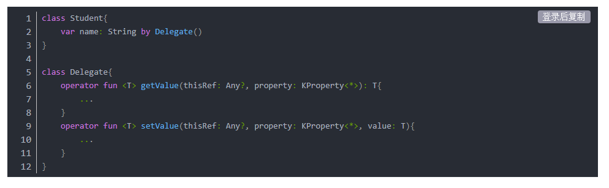
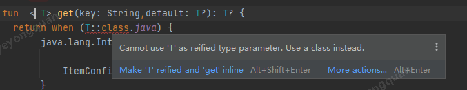
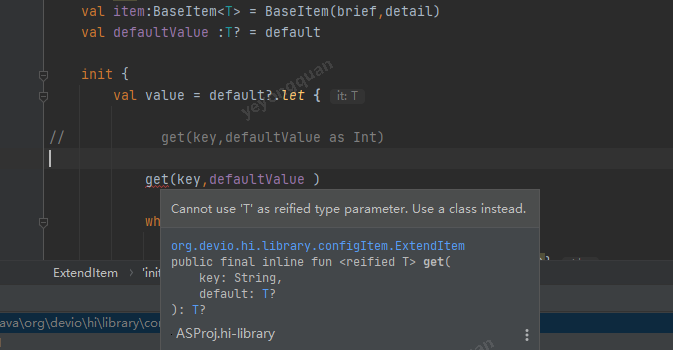
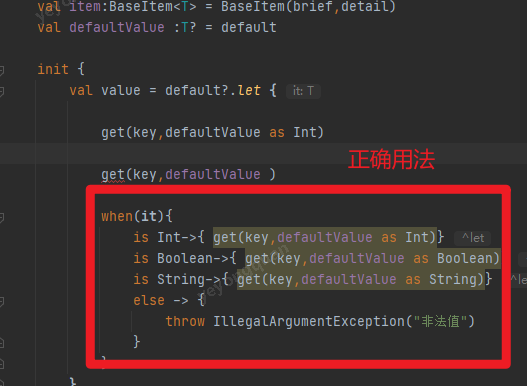
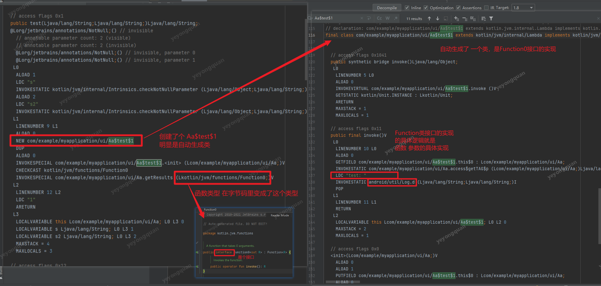

# 伴生对象

# 属性代理





实际上就是把一个属性的访问 委托给一个委托类
这个委托类要实现  get/setValue 
持有这个属性的类 只需要管 set和get。
内部的实现就都交给这个委托类即可 

比如sp 就是一个很好的例子。
用属性代理的话 就直接些get ,set就行了

```kotlin
class PreferenceDelegate<T>(private val context: Context, private val name: String, private val default: T, private val prefName: String = "default")
	: ReadWriteProperty<Any?, T> {
	private val prefs: SharedPreferences by lazy {
		context.getSharedPreferences(prefName, Context.MODE_PRIVATE)
	}

	override fun getValue(thisRef: Any?, property: KProperty<*>): T {
        println("setValue from delegate")
        return getPreference(key = name)
	}

	override fun setValue(thisRef: Any?, property: KProperty<*>, value: T) {
        println("setValue from delegate")
		putPreference(key = name, value = value)
	}

	private fun getPreference(key: String): T {
		return when (default) {
			is String -> prefs.getString(key, default)
			is Long -> prefs.getLong(key, default)
			is Boolean -> prefs.getBoolean(key, default)
			is Float -> prefs.getFloat(key, default)
			is Int -> prefs.getInt(key, default)
			else -> throw IllegalArgumentException("Unknown Type.")
		} as T
	}

	private fun putPreference(key: String, value: T) = with(prefs.edit()) {
		when (value) {
			is String -> putString(key, value)
			is Long -> putLong(key, value)
			is Boolean -> putBoolean(key, value)
			is Float -> putFloat(key, value)
			is Int -> putInt(key, value)
			else -> throw IllegalArgumentException("Unknown Type.")
		}
	}.apply()

}

```


## lazy

by lazy{ }

就属于属性代理


# reified 更安全的泛型


reified 都是配合着 inline来使用的。 实际的本质就是在编译时就解析出来对应的泛型的实体是啥 ，在编译期就直接替换。
到了class文件中就不是泛行类了 而是 具体类 所以可以直接使用T::calss.java来判断类型

```kotlin
    inline fun  <reified T> get(key: String,default: T?): T? {
       return when (T::class.java) {
            java.lang.Integer::class.java -> {

                ItemConfigManager.getInteger(key,default as Int?) as T?
            }
            java.lang.String::class.java -> {
                ItemConfigManager.getString(key,default as String?) as T?

            }
            java.lang.Boolean::class.java -> {
                ItemConfigManager.getBoolean(key,default as Boolean?) as T?
            }
           else->{
                throw IllegalArgumentException("非法参数")
           }
    }
```

要是没有 reified的话就会报下面的错误。



用法上注意由于reified的本质就是替换成实体类所以

编译期编译期是必须得明确的知道实体类型的否则会报下面的错误



正确的用法



# Kotlin传函数是怎么实现的


以下面的代码来看

```kotlin
package com.example.myapplication.ui

import android.util.Log

open class Aa {

    private val TAG:String = "A"
    open fun test(s:String,s2:String):String{
        getResults {
            Log.d(TAG, "test: ")
        }
        return "1"
    }

    private fun getResults(method: () -> Unit) {
        method()
    }
    override fun hashCode(): Int {
        return 1111
    }
}
```


查看下 对应的字节码。看关键点



根据上图总结，
实际上 字节码中函数型参数是被转化成了接口了的。
kt的编译器自动帮我们生成了接口的实现类。
函数参数的执行，就是接口的接口函数的执行。


