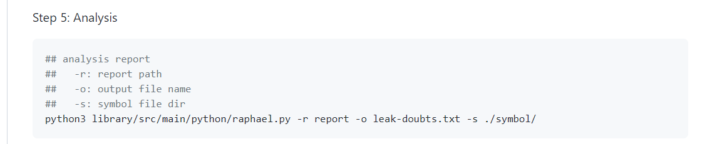
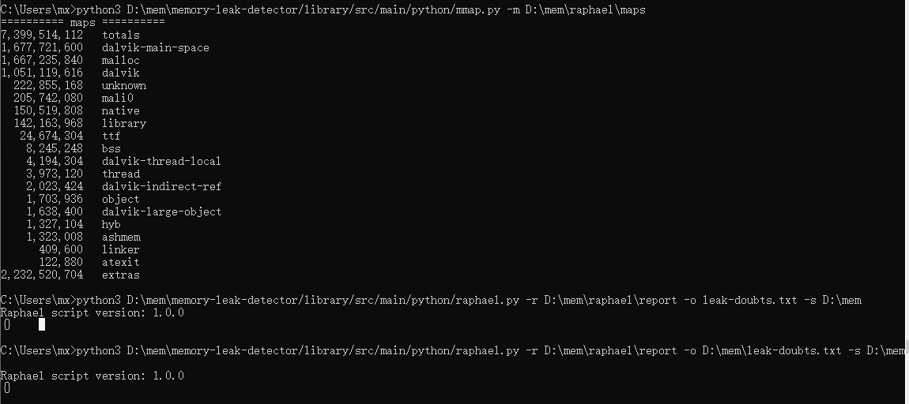
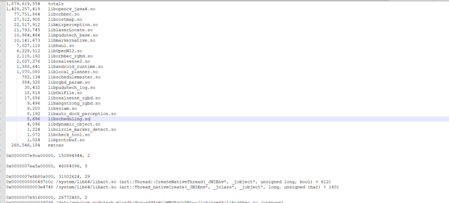

推荐一个很好用的 native 内存泄漏检测工具,git地址：[https://github.com/bytedance/memory-leak-detector](https://github.com/bytedance/memory-leak-detector)
​

#### 使用方法：
按照github里面步骤执行就行
对第5步进行一下解释

## analysis report 
##   -r: report path   第四步得到的文件路径，在机器sdcard/raphael下面，需要pull到电脑上
##   -o: output file name   输出分析结果文件名
 ##   -s: symbol file dir  符号表的位置（这个我不太清楚，有点类似类似android的mapping文件，如何获取，等                                        有空研究一下）
python3 library/src/main/python/raphael.py -r report -o leak-doubts.txt -s ./symbol/

下面是我使用工具得到的文件截图

#### report：

#### leak-doubts:

