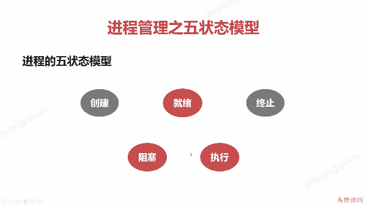
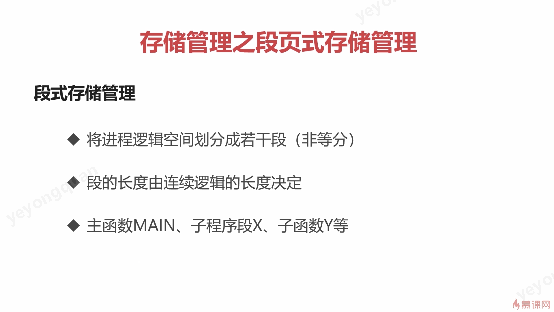
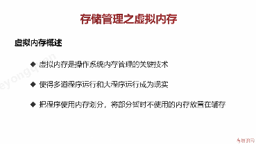
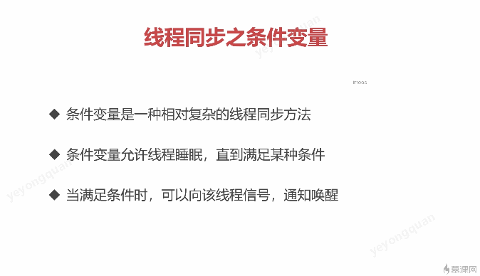

# 操作系统


## 进程

### 进程的出现

在操作系统出现之前，
计算机资源只属于当前运行的程序的。
程序只能一个接着一个的来执行。
这样一个接一个的来执行 ，由于cpu运算速度和IO速度的不匹配会导致计算机的整体效率低，而且也也不能并行执行程序。

所以配置上操作系统后，引入了多道程序设计的概念。
多道程序设计的目的就是为了 在一段时间内，看起来是多个程序同时执行的。

为了达到同时执行的这个目的，就自然有了进程的概念。
这个为了进程之间互不影响 那么就需要合理的隔离资源， 运行环境；

进程就是为了操作系统对多道程序同时执行所做的资源分配，资源隔离，运行环境的管理所产生的概念。


### 进程的实体


一个进程里会有一下这些信息：

标识符：  进程的唯一标志
状态： 运行/ 阻塞
程序计数器：功能和cpu里面的程序计数器功能类似
内存指针：有多个， 指向程序代码，进程数据的相关指针
上下文数据：进程执行时 处理器存储的数据
给cpu用的
IO状态信息：被进程IO操作所占用的文件列表
记账信息： 使用的处理器使用，时钟数总和等。用于调试追踪（类似 andoird 里的/proc/stat 文件）


以上这个信息  用进程控制块来统一管理。
也就是说 进程控制块来描述和控制进程运行的状态的通用数据结构

操作系统 专门有一块内存 来存放 PCB信息。


有点不懂，操作系统切的是线程还是进程?
切的是线程的话，那么线程也应该要有类似进程控制模块这些信息呀。事实上也是这样的。
进程控制块PCB,进程也有相似概念线程控制块TCB


### 进程与线程

线程是系统进行调度的最小单位。
现在的操作系统 线程都是内核态的。

这样cpu才能公平的感知各个线程。
要是用户态的话， 那么cpu只能感知到 进程，
进程下的线程需要再通过进程去分配才能达到多道程序同时执行的目的


进程才被分配系统资源的，线程只是能使用所属进程的资源。


进程管理 -五状态模型



### 进程同步

多道程序并发时，由于有高数缓存的存在，
在并发情况下，进程控制块的数据很可能已经不准确了。


发生上图错误的原因就在于，
红色进程在保存运行环境的时候相关数据已经被篡改了。
也就是红色进程的进程控制块的数据，保留的数据，并没有跟随着后续改动而改动。

为了避免这种情况，所以就需要进程间的数据同步。

#### 同步的原则

临界资源作为共享资源却又无法同时被多个线程共同访问的共享资源。当有进程在使用临街资源时，其他进程必须依据操作系统的同步机制等待占用进程释放该共享资源才可重新竞争使用。

```
question：
之前做android开发是都是 对 进程内做线程同步处理。
根据每一个android进程都有一个独立的虚拟机，所以对于android系统来说，应该还有一个虚拟机和虚拟机之间的同步处理。
```


同步的方法

进程的同步


线程同步

·


```
ps:
无论是andoird虚拟机，还是jvm,
本质就是一个操作系统上的一个进程。
程序是运行在这个进程上的。
所以一个虚拟机就是一个进程，一个虚拟机是无法有两个或者以上的进程的。

虚拟机进程之间的同步是只有操作系统有能力做。
虚拟机只能做到进程内的线程同步。
所以说感觉 AQS这种锁 在多个进程中是没有用的。
syncnize 这种影响到cpu的锁 应该才能影响到别的进程

```


### Linux的进程管理


## 存储管理

### 内存分配的过程


内存空闲标记。
数组
链表

首次适应算法：
从内存链表里的头开始找 找到第一个满足条件的就用；

循换适应算法：
和首次适应算法 不一样的地方就是，
不再从头开始找，而是从上次分配的地方开始找

最佳适应算法：
遍历整个内存链表，找到最合适的内存块。
这样链表拍个序， 那么链表就从头开始找。
找到第一个满足的就是最适应的


快速适应算法


### 内存回收的过程

分一下四种情况：


第一种：
不需要新增节点，直接改容量即可
第二种：
要先合并， 在用回收区 作为新的空闲区的地址
第三种：

要合并 成一个
第四种：
直接插入即可。


### 段页式存储管理

前面是用物理层面来理解存储管理，现在从进程的角度来理解存储管理

操作系统是怎么管理 进程的内存空间的呢？


#### 页式存储管理


可能会导致碎片过多。


页表中 记录了实际内存的物理地址。
对进程来说 页表里的内存逻辑是连续的。
但是实际物理上可能是分开的。

页式管理的问题
现在计算机的进程可用的逻辑地址空间 很大
2<sup>32</sup>~2<sup>64</sup>
加入一页式4KB的话，那么页表项就有1M，
如果一个页表项占用1Byte的话，那么每个进程的页表就要占用1MB的内存空间了
所以出现了多级页表管理。也就是不是一口气把页信息全部读完 而是先读好入口，然后按需读取。

有一段连续的逻辑分布在多个页的时候，这样会大大降低执行的效率。
因此为了提高效率有了段式的存储管理。

#### 段式存储管理


页式 每页大小都是固定的
段式的 每段大小是不固定的，所以段表会更多内容，比如说每段的大小。
但是内存碎片会小一些。


逻辑空间先确定好， 然后再去物理空间中取找。




无论是段式还是页式都离散了进程的逻辑空间对应的物理空间。

但是段式管理的 内存浪费的现象更加严重，
为了结合段式和页式的 优势  就有了段页式的管理方式。

#### 段页式存储管理

简单来说就 段内分页管理。


其实段页式 就是在页式的基础上 有了 页之间是否是连续的这个信息。

#### 虚拟内存


概述：


为什么要有虚拟内存？


程序的局部性原理
程序运行时，是只加载一部分到内存当中，其他部分是在辅存里的。
但要查找的页不在内存中时，再根据替换算法把目标页给加载进来。


置换算法

- FIFO
- LFU
- LRU

和 cpu - 高速缓存的置换算法一致。

### Linux的存储管理

Buddy算法


Linux 交换空间


### 操作系统的文件管理

#### 文件的逻辑结构

- 文件类型
- 顺序文件
- 索引文件


顺序文件的 增删改 都 效率很低。类似数组
所以才引出了索引文件

索引文件
就是有一个索引表， 里面的值才是真正的存放数据的地方。


#### 辅存的分配方式


连续分配


链接分配


隐式链接  随机访问效率很低，可靠性比较差。


读文件的时候 要把 整个FAT 文件给加载进来。
所以存储消耗高
文件需要额外空间记录相关信息


索引分配

用多一个盘块来记录全部文件的索引。


#### 辅存的空间分配


空闲表和 空闲链表 和主存的分配 基本一致。

但位示图是主存分配当中没有的。


空闲表


空闲盘区


位示图
主流方式

盘块/磁道


## 线程同步


#### 互斥量

互斥量 的作用就是保证临界资源相关操作的原子性、


互斥量的用法


这个互斥量是操作系统级别的处理，调用的是系统接口
也就是不占用cpu算力的。但是会有线程上下文切换的开销

对应到java的就是sychonize 的最终形态

#### 读写锁

一种允许多个同时读的特殊的自旋锁


读 写 之间互斥。
写写 之间互斥。


#### 自旋锁


自旋锁操作系统也是有给api的。
但是实际上是不用操作系统的api，自己来实现自旋接口也是可以的。

直接用个 boolean 来处理就可以了。
但是系统的接口 是不是 对进程间的同步也会有约束力？
毕竟自己写的 只能影响到本进程。


#### 条件变量




条件变量需要配合 互斥量操作。
注意 休眠只是休眠本线程， 唤醒是唤醒被改条件变量休眠了的全部线程
这个休眠的api 对应到java中 就是Object.wait （）和Object.notifyAll()


可以看出 操作系统的条件变量是要和互斥锁配合使用的。

所以java接口也应该会有这种限制。

这就解释了为什么   jvm下notify和wait 必须在synchronized 的配合下使用（否则会抛出异常)，这个是操作系统层面就决定了的

也就是说 java中的object 本身就是一个条件变量的。


## 进程同步


### 进程创建


使用fork  系统调用 创建进程。
fork 会返回两次。父进程 和子进程 加起来两次。

子进程的初始状态和父进程的执行fork时一样的。


### 共享内存

进程的线程是共享进程资源 的， 所以线程之间需要同步。

进程是共享计算机资源的，所以也是需要同步的。

本身进程之间是共享物理内存的，但是由于操作系统的进程管理， 进程之间的内存空间是独立的。


共享内存 就是提供了进程之间的内存的公用。


申请共享内存 是 用 key 来申请的。
使用共享内存的步骤。


server端和 client端 用项目的key就能指到同一块共享内存当中了。


### Unix域套接字（socket)

服务端


客户端


客户端和服务端都是 关联到同一个文件 从而连接起来的。
服务端和客户端的区别就是：

- 服务端 进行监听
- 客户端进行发送数据


ps:从系统的接口来理解原理 比java封装后的好理解的多。


#### 管道，信号量通讯等其他IPC 方式