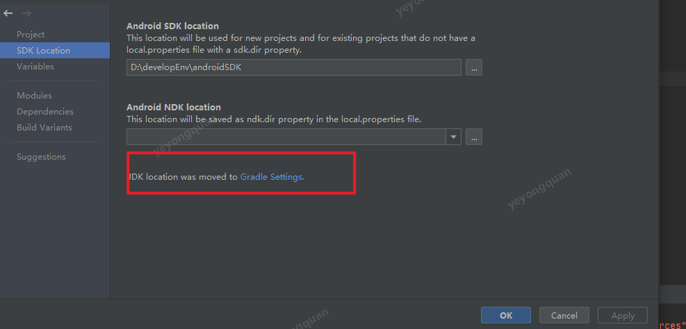
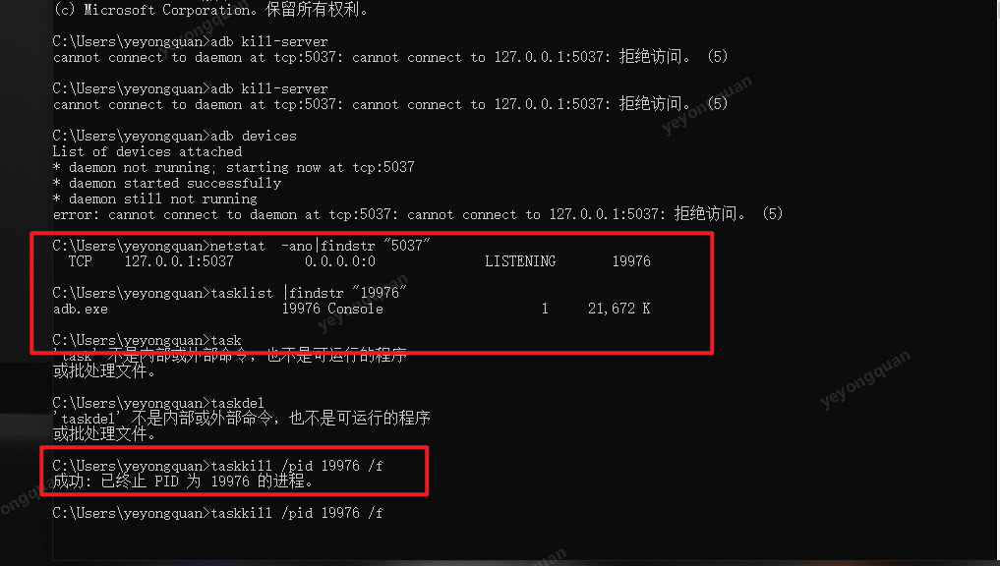

# java.lang.reflect.InvocationTargetException (no error message)


[unrecognized Attribute name MODULE (class com.sun.tools.javac.util.SharedNameTable$NameImpl)](https://stackoverflow.com/questions/68344424/unrecognized-attribute-name-module-class-com-sun-tools-javac-util-sharednametab)

原因是 编译版本和 jdk版本不兼容

解决办法 有

1. 降低compileSdkVersion

2. 将jdk版本提高到11 




# Program type already present：XXXX


先试试 clean project
如果还有的话 就得检查重复依赖的问题了。


# 资源正在被占用

https://blog.csdn.net/shenggaofei/article/details/103234325


# More than one file was found with OS independent path 'META-INF/INDEX.LIST'


fix  

```
//android{}
    packagingOptions {

        exclude 'META-INF/INDEX.LIST'

    }
```

# Program type already present: androidx.activity.ktx.R$color

clean project .
如果不成功就把 java 进程杀死后 再clean  project 


# 一直在loadingDevice 无法RUN





# AndroidStudio一直在loadingDevice


  adb 也有异常， 那么就很有可能是端口  有冲突引起的。
要么找到冲突方 ，要么修改adb的默认端口

我的解决办法是把adb端口从5037
