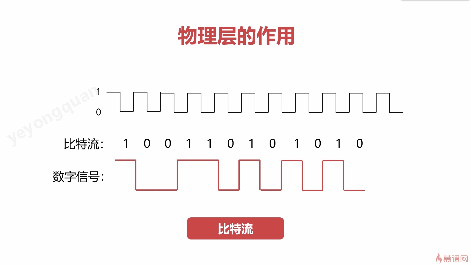

## 历史


ISP：网络服务提供商


州和州之间的互联网的连接是通过海底电缆连接起来的。
世界主干电缆图


## 层次结构

### 分层原则


网络要解决的问题：

1. 保证通讯通畅
2. 能够识别目的计算机
3. 感知目的计算机的状态
4. 数据是否证据

计算机网络通过分层设计来 把问题细化 ，分层实现不同的功能。


### OSI七层模型


应用层 ： 用户的初始数据

网络层 决定 数据在整个网络中的路径，
数据链路层只关心 我的上级和下级。


```
像TLS的加密就是表示层的功能
但是tls的握手的协议啥的 又是 会话层的功能。
所以说一个网络协议有可能横跨多个网络层级
```

OSI 是理论上被认可的模型，
但是OSI提出时，TCP/IP 已经在全球范围内应用了。


比如说OSI 里面 网络层的 功能 和 链路层的功能感觉就有点 重复。


实际上 TCP/IP 的四层模型 应用的更加广泛。

TCP/IP 四层模型


### 现代网络拓扑


### 物理层




为了提高信道的利用率， 物理层还通过复用技术来将多个信道集合在同一个通道中。


### 数据链路层


物理层的传输的基本单位是  比特位， 而链路层的基本单位是帧。


如果 传输内容中有 帧标识怎么处理？
透明传输就是为了解决该问题


也就是解决办法就是加一个 转义字符。

接收端在接收的时候 链路层到网络层的时候再取消遇到的第一个转义字符，那么就是原文了。

原理就是类似 输出文本的时候 '/'字符。


差错监测

链路层做了CRC 校验。
并且把CRC校验的信息带在尾部。
数据链路层 只做监测 不进行纠正。
数据链路层发现数据有错误， 那么就直接丢掉这一帧。

#### MTU

数据链路层 的帧的长度不是无限大的，是受MTU 约束的。
MTU 是由物理层的特性约束的。


#### 以太网  协议详解 -数据链路层

路由器怎么知道A的数据是要发送给谁呢？


也就说  以太网协议 就会在每一帧 当中 添加  目的mac地址 ，源mac地址

路由器中会存有 MAC地址表， 这个地址表中就有 mac地址和接口的映射。

路由器就会根据 帧数据中的目的mac去表中查找， 这样路由就知道数据该往哪个接口发了。

路由中的MAC地址表怎么来的呢？
如果路由不知道的话，就会发一个广播
各个接口收到广播之后，都会回应。
路由器收到回应之后 就记录下来。根据应答就能更新MAC地址表的数据了。

要是多级网络，  是怎么知道目标的mac地址的呢？
这个时候 链路层就没有办法知道了。
所以说链路层只能知道相邻的路劲怎么走。
整个网络中的路径，得依赖网络层来确定。


### 网络层


ps:路由器使用的最顶层的协议就是网络层协议


#### IP协议


端到端中， 物理的路径可能有非常多。
到底走哪条？物理路径会很复杂。

在原本的物理连接上 ，抽象出一层 虚拟互联网络。
这个虚拟互联网络的连接 是实际物理连接的简化。
然后IP协议就是解决 数据如何在这层虚拟互联网络中传输。


网络层中的传输 加了一个概念，那就是IP地址。
IP地址 是会随着网络环境变化的。
而链路层关心的 mac地址是 永远不变的。


IP协议的数据报总长度是 65535，远远大于MTU ，所以链路层传输的时候会对IP报文进行分片，拆成多个数据帧进行传输。

```
疑问： 那实际的网络传输中，是先走网络层通讯，找到目标设备，然后再感知到目标的mac地址， 然后再走链路层通讯？
实际上并不是的。
链路层加的不一定最终的目的的mac,而是下一跳的mac。
也就是很有可能是 路由器的mac。
路由器收到之后 ，再转发的时候，就是把目的mac给替换成再下一跳的设备的mac。

所以说对于一个网络传输来说， 网络上带的ip信息 是一开始就是最终的目的IP，但一开始带的mac地址不一定时最终的目的设备的Mac。
所以说 局域网下的每一个设备 虽然没有分配IP的情况下， 其上层路由都能找到。
但是上层路由外部的网络设备就没有办法感知到了。因为外部网络没法知道 想要访问的mac是多少。所以除了mac之外，还得分配一个ip来让外部感知到。

其实不加ip也行，  网络层再套层mac地址，但是如果是再套层mac地址的话， 那就是每过一跳 就要 套一层。
这样明显是不合理的。 用ip这种 合理一些。 
```


IP协议中的关键字段

- 目的IP

- 源IP

- 协议标识

- TTL ： 避免找不到目标的消息 无线的网络中传输

  


#### ip转发流程

路由表

mac地址表 - 路由表


这路由表哪来的？
rip 协议 ，后面讲。


#### ARP、RARP 协议

ARP的作用 ：
通过arp 缓存表      ip地址   -- 》  mac地址

arp 使用到了ip 所以arp协议是网络层的内容。

RARP： 逆地址解析协议
基本已经废弃了

作用：由mac 拿ip ，


#### NAT

由于ip资源不够用，所以才有了这个网络地址转换NAT

内网的ip地址实际上都是对应到同一个外网地址
那这时候外部怎么知道是哪个设备在请求呢？
内网IP会冲突吗？
如果内网IP不会冲突的话，那直接用IP来确认不就行了么？
还是说到了外网之后， 网络层会把ip 换成公网Ip?
是的，公网上的路由器不会转发内网地址的ip数据的。
为啥要设计成公网路由不转发内网地址？
如果内网ip能直接向公网发消息的话， 那就会出现ip重复的情况了。网络层只管了源IP ，又不管源IP的网关的IP，所以说内网IP是不能在公网路由上转发的。


nat 的作用就是作用了  内网+端口  和外网+端口的映射的双向转换。

#### ICMP

辅助IP协议传输的。
ICMP协议是封装在IP协议中传输的。


ICMP 主要在网络层上  确认 网络是否正常，有啥异常。

ICMP的应用

##### ping

所以说ping是网络层的命令。
ping 中的延时的数据 就是icmp中询问报文的请求/应答的差值的出来的。


##### tracerouter


ttl 为 0 了之后，网络设备就会丢弃这条数据， 并且向源设备发送一条icmp 消息，提示源设备 网络有问题。
traceRouter 利用的就是ttl为0后，网络设备 会主动回复的这个特性，以此的发送 ttl  0,1,2....    然后根据回复来记录下路径，直到 不回复icmp的错误信息就说明到终点了。


#### 网络层路由

这里要解释 路由器的路由表是怎么获得的。


算法的要求


##### 内部网关路由协议

###### RIP

DV算法
记录下本节点之间的 距离信息


有可能 A节点 记录的 到B节点的距离和 B节点记录的到A节点的距离并不相等。因为可能有一份数据不是最新的，是之前的数据。


以A节点作为设备进行分析：
根据A设备自己分析 以及 其他节点发送过来的 各个节点距离信息

根据信息的比对， 得到 最优的下一跳的信息。
感觉逻辑应该是 一开始的时候 A节点只知道自己到各个节点的距离，这时是不知道距离最短的下一跳是谁的。
然后收到一个 其他节点B过来的包 就更新一下，对比下是不是通过这个节点B到目的节点X距离更短，如果更短的话，那么就把目的节点X的下一跳指定为节点B

并不需要来齐网络中的全部信息再一起比对。
比如说
A 节点 记录的 A 到 C的 距离是  30,A到B的距离是10
这时A收到了B的距离信息： B到C的距离是10

这时A就可以判断出，
A到B 再到C的距离是  10 +10
比原先A中记录的 A到C的距离要短，那么就把B作为到C的下一跳，记录到S向量中。


RIP的流程


问题：
路由信息 是要全部节点的吗？
到每一个节点的跳数是怎么知道的？
难道是像traceRouter那种用ttl来确认的吗？
是要知道所有节点。
不需要像traceRouter那样处理。
路由是知道直连的设备的信息的。
然后相邻的路由之间会定期广播。
那么由于是在内网之内，所以内网的所有设备都是互联的。
只要有足够的相邻路由的信息交换那么每个路由都能建立内网络的全部设备的路由表。
这个路由表就是对于也就是下一跳信息。


RIP 协议的缺陷

当A down了之后，B 只能知道自己对A不可达了，

这时B询问C，就认为了C对A是可达的。（实际上C对A的可达是依赖B对A的可达的），这时B就更新路由表， 认为B通过C可以访问A。

对于C来说 也有这个问题。当C 访问A失败的时候，
会询问相邻节点，这个时候C就会相信B中记录下的错误信息，并且更新。
这时导致B,C的路由表中对A的跳数会不断增加， 直到跳数大于rip的限定值时，才会认为A是不可达的了。
也就是说rip协议对一个设备的不可达的情况，会有比较大的延时才能感知。


###### OSPF协议

迪杰斯特拉算法


先记录下A节点直连的其他设备的距离， 然后对U集合排序，
按距离排序取U集合的元素， 取U集合元素时，要分析该元素对其他节点的直连节点的距离，如果距离短过A原先记录的，那么就替换，并且下一跳记录成该节点。

OSPF 协议


LS协议路由器消息会在整个网络中的路由中传播。
RIP 协议 只会和相邻的路由器交换信息。


ls协议 只有在 链路状态发生变化的时候才发送消息
rip协议的话，是定时发送的。


ospf协议的过程
ospf协议下 网络中的每一个路由器获得的信息是一样的。
都有完整的网络拓扑信息，从而可以独立的通过 算法去获取 最短路径。


rip协议只用了跳数来作为距离的判断
ospf 中还有 时延，带宽等其他信息。


整体过程


正常来说 已经接入网络一段时间的邻居是已经有完整的网络拓扑的了。
新接入的路由器 先和 邻居交换信息，同步，然后再广播出去，同步给其他路由器。
这样新加的路由器的能力 就通知给网络中的所有路由器了，新加入的路由器也获取到了补充完整了整个网络拓扑。


##### 外部网关路由协议

###### BGP协议


BGP 协议 能够找到一条到达目的比较好的路由，不一定是路径最短的，这个和ospf，rip不一样，主要是因为有很多人为的因素干扰。

BGP 很复杂， 而且 基本用不上， 现有个概念就好。


### 传输层


传输层的工作是在终端设备上,不需要依赖别的设备

传输层管理的是 端到端的处理。
这个端 是终端 ，还是网络请求的终端（进程？）


传输层 使用了端口 来区分 终端的多个网络通讯。
但是端口并不是 只在传输层作用的，
在网络层，nat穿透时 路由器也是要感知端口的存在的。
所以说应该是传输层借助了网络层端口的概念来达到了端到端的目的。(个人认为端口是网络层的概念，脱离了端口网络层就没法实现内网到外网的访问了)

看起来 传输层 主要 约束的是 要怎么传这些来自应用层的数据。比如说 可靠些的传就用 tcp， 简单快速的传就用udp,
所以说 传输层 起到的就是管理的作用，而不是寻址查找，
寻址查找是网络层和链路层来处理的。

##### UDP


##### TCP

待补充


##### SOCKET

ip + port 就是一个socket


### 应用层

