### 前言
uiautomator2 是一个自动化测试开源工具，仅支持 Android 平台的原生应用测试，不需要了解开发代码细节，适用于黑盒测试。uiautomator2 是python里面的一个库，有相对比较便利的各种接口模拟事件。另外weditor库可通过可视化的方式，操作手机应用，并且自动生成python代码，大大提高了自动化代码编写的效率。（目前一些主流自动化测试框架: Appium、Instrumentation、Espresso、Robotium 等，各种框架有它各自的优缺点，要针对不同项目选择不同的框架，提高自动化测试的效率降低测试成本）
​

### 环境准备
#### 1：python3环境
官网下载对应系统的安装包
官网：[https://www.python.org/downloads/](https://www.python.org/downloads/)
安装包安装好以后要把python环境添加到系统的环境变量里面去
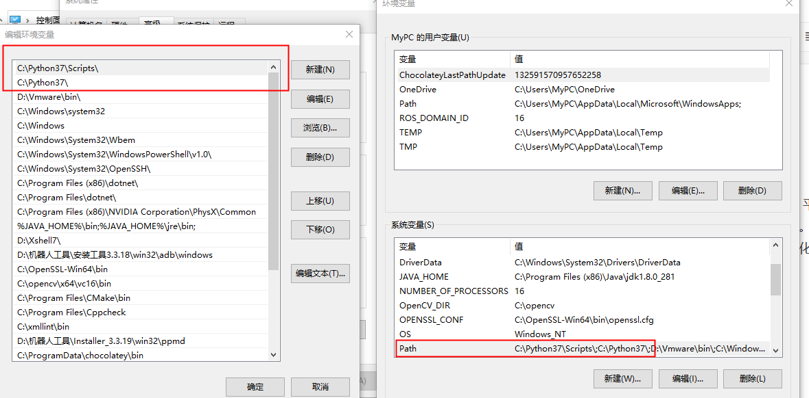
然后在cmd命令行输入:python
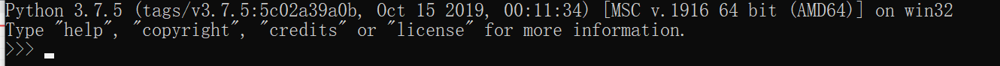
看见进入到该终端以后，则表示python环境安装完成，python的基础语法以及安装细节请参考python上路指南文档。

#### 2：安装adb
如命令行可以执行adb devices，则跳过此步骤（应该都有）
从谷歌官网下载 Android Platform Tools [https://developer.android.com/studio/releases/platform-tools.html](https://developer.android.com/studio/releases/platform-tools.html)，解压，并加包含adb.exe的目录加入到系统的 PATH 中。
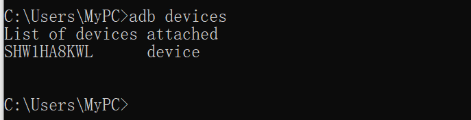

#### 3：安装uiautomator2 库
  通过pip来安装这个库，pip是python的一个包管理工具，提供了对Python 包的查找、下载、安装、卸载的功能。python3.4以上自带这个工具。通过pip --version查看是否安装。

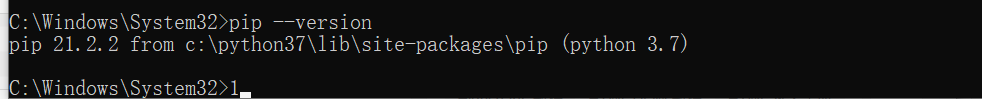
 通过一下命令安装uiautomator2库。

```shell
pip install -U uiautomator2    
```
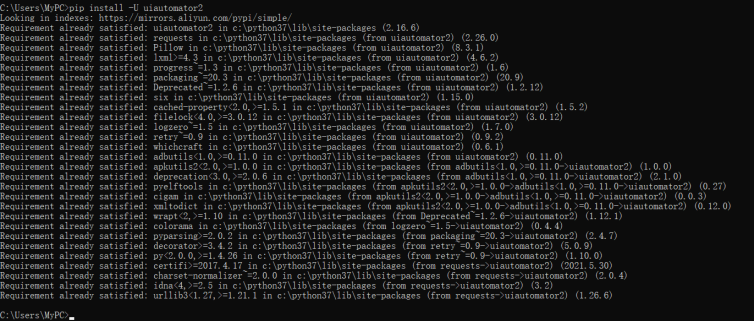


没有报什么错误的话表明安装没什么问题。

#### 4：Android端安装ATX-Agent应用
该应用运行了封装了 uiautomator2 的 HTTP 服务，解析收到的请求，并转化成 uiautomator2 的代码。在PC端通过以下命令为Android端安装atx-agent应用。（注意adb要连接上机器人）
```shell
# 安装apk服务到手机上
python -m uiautomator2 init
```
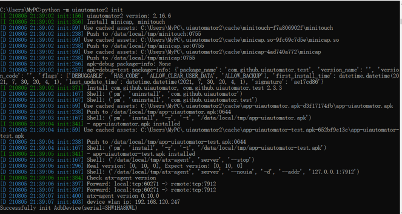


Successfully init AdbDevice以后，Android端的桌面上会多出一个ATX应用，如下图所示。

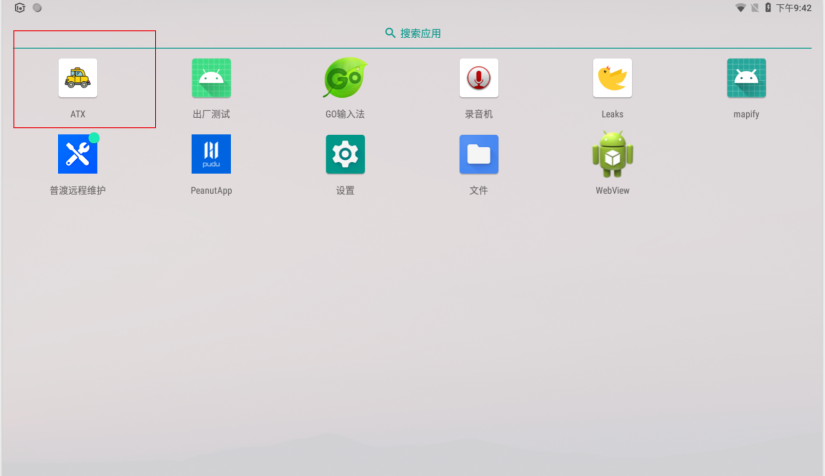
点击进去瞄一眼，可以看到这个实际上就是提供一个后台服务，将PC端传过来的python生成的http请求解析转化成uiautomator2的代码。

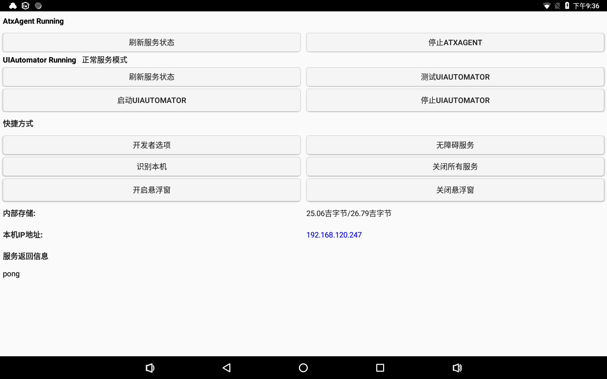 

#### 5：安装weditor
  Weditor 通过 ip 连接手机，即可以实时查看 App 的界面元素信息和 Appium DeskTop 类似，可以模拟点击、滑动操作、生成操作源码等功能。首先，通过 pip 安装 weditor 依赖包
```shell
# 基于浏览器查看 App 的界面元素
pip install -U weditor
```
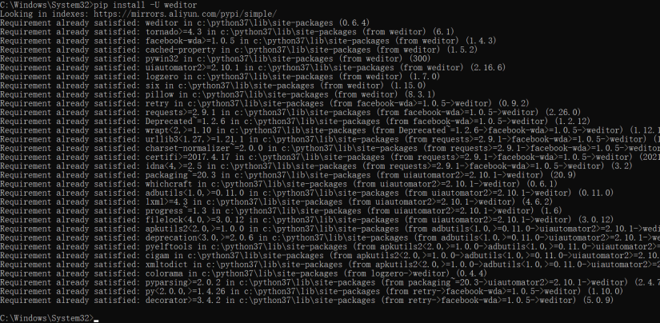


```shell
python -m weditor  #命令行输入后，会自动打开浏览器
```
然后，在命令行输入 weditor，会自动在浏览器中打开，接着通过 ip 连接对应的设备，即可以获取设备端当前界面的控件信息，信息内容包含：控件的层级关系、控件 ID、文本内容、坐标值等内容。我们在左边双击各种按钮操作，在右边的代码框会对应生成该操作的代码以及对应操作的元素。


按照自己的流程操作一遍，然后把右边的代码拷贝下来，用python命令运行，则会自动操作对应点击事件。例如将右边拷贝下来另存为AutocheckTest.py，然后在cmd命令行里面执行即可:

（实际上操作需要等待各种元素出现才能执行下一步操作，并不能完全自动化。需手动修改一些python代码)。后续学习深入的话可以将代码打包成exe可执行文件或者通过QT库加入自己写的UI界面。


### UiAutomator2 入门学习
#### 1：连接设备
使用 UiAutomator2 连接设备有 3 种方式，分别是：

- 局域网设备 IP 地址
- USB 连接 + 设备序列号
- ADB + IP + 端口号
```python
import uiautomator2 as u2

# 方式一：局域网设备ip地址
device = u2.connect(手机ip地址) //例子:device = u2.connect('http://192.168.120.247:7912') 默认端口7912

# 方式二：USB + 设备序列号
device = u2.connect(r'手机序列号') //例子device = u2.connect(r'SHW1HA8KWL')

# 方式三：ADB+
# 首先，设备用USB线连接PC，输入命令：adb tcpip 端口号进行映射
# 拔掉USB线，通过ip地址+端口号进行连接
device = u2.connect_adb_wifi(手机ip地址:端口号)

#方式四:直接不带参数（推荐）
# 首先adb 连接上Android端，无论是usb线还是通过wifi
device = u2.connect()  

# 连接设备后打印设备的信息
print(device.device_info)
```
首先说第一种方式，例如机器人的ip是192.168.120.247 ，序列号为SHW1HA8KWL则通过以上例子即可。推荐使用方式四，避免一些其他错误，执行以上python代码，可以看到以下设备信息被打印出来。

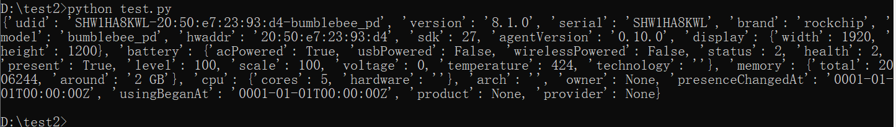

#### 2：apk包的启动与关闭
  app的启动有两种方式，第一种通过元素定位执行点击事件启动，第二种通过包名调用api启动。
```shell
import uiautomator2 as u2

# 连接手机 adb
device = u2.connect()

# 方式一：观察桌面图标的应用名称，找到名叫MirSDK的图标，执行点击事件
device(text='MirSDK').click()

# 方式二: 通过包名调用app_start函数启动
# 不清楚包名的，可以通过 adb shell pm list packages列出所有包名
device.app_start('com.pudutech.mirsdk')
```
app的关闭可通过调用Back键，或者通过函数API关闭
```shell
import uiautomator2 as u2

# 连接手机 adb
device = u2.connect()

#方式一: 点击物理键盘Back键
device.press("back") # 点击back键

#方式二: 函数API调用
device.app_stop('com.pudutech.mirsdk')
```
其他包操作,apk包的数据清除以及卸载
```shell
# 清除 app 的数据
device.app_clear('com.pudutech.mirsdk')

# 卸载
device.app_uninstall('com.pudutech.mirsdk')

```
#### 3：设备的信息和包信息


以下命令可以获取包的信息，当前页面信息以及设备的详细信息。
```python
import uiautomator2 as u2

device = u2.connect()

#获取当前运行包名以及页面的信息
print(device.app_current())

# 获取包名2：所有正在运行的程序
print(device.app_list_running())

# 设备信息
print(device.info)

# 更加详细的信息
print(device.device_info)

# 获取屏幕大小 数据类型是一个元组
print(device.window_size())
```
输出如下：

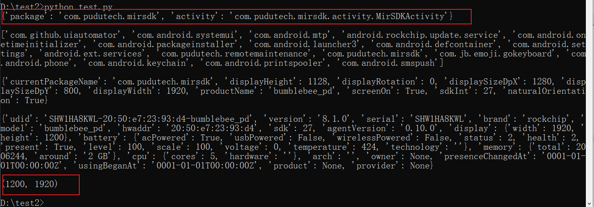
其他常用操作：截屏，拉日志，推送文件

```python
//将设备当前屏幕截屏到电脑的路径上,并命名为test.png
device.screenshot(r'D:\test2\test.png')

# 推送文件并另存为test.config
device.push(r'D:\test2\test.config', '/sdcard/pudu/config/test.config')

# 拉取文件
device.pull('/sdcard/pudu/config/camera.config', r'D:\test2\test.config')
```
#### 4：按键操作
常用的点击事件，物理软键盘按键，音量+-按键，电源按键，home键、菜单键等等：
```python
device.press("down") # 点击下键
device.press("center") # 点击选中
device.press("menu") # 点击menu按键
device.press("search") # 点击搜索按键
device.press("enter") # 点击enter键
device.press("home") # 点击home键
device.press("back") # 点击back键
device.press("left") # 点击左键
device.press("right") # 点击右键
device.press("up") # 点击上键
device.press("delete") # 点击删除按键
device.press("recent") # 点击近期活动按键
device.press("volume_up") # 音量+
device.press("volume_down") # 音量-
device.press("volume_mute") # 静音
device.press("camera") # 相机
device.press("power") #电源键

#其中点击事件需要定位到某个元素，确认下你点击的是哪个
#例如这个定位到MirSDK上的icon图标,然后触发点击事件
device(text='MirSDK').click()
```
#### 5：通过weditor辅助定位元素
  如上，想要通过元素控件id定位到该元素，除了看代码外，可以通过weditor定位。例如，我现在想打开自检页面，肯定是要点击StartUp。我们可以通过device(text='StartUp').click()，但是假如页面上有两个叫StarUp的按钮怎么办，就和人的名字一样，同名是肯定会有的，但身份证号是唯一的。因此通过该工具，将鼠标移到StartUp按钮，则可以看到该按钮的id是com.pudutech.mirsdk:id/buttonStartUp ，双击它，会执行自检同时右边会生成该操作的python代码。

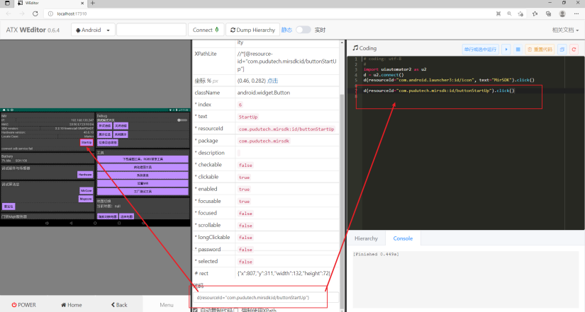


有些较复杂的元素可能无法定位到唯一的元素，需要使用上下级层级，child、sibling等属性进行操作，具体用法自行百度或谷歌。

#### 6：点击操作
  通过上述的属性，应该会比较属性点击操作了，直接定位到元素再执行click事件即可，上面的我们是通过文本和id进行定位，另外我们还可以通过坐标定位以及百分比定位。

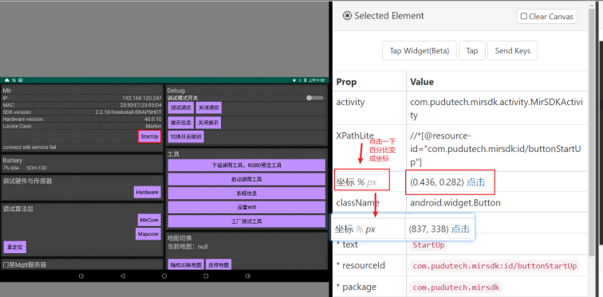

```python
#百分比定位元素
d.click(0.436, 0.282) 
#坐标定位元素
d.click(837,338)
```
#### 7：滑动操作
    我们软件上有一些亮度控制，音量控制都会有一个滑动条，这时就需要模拟滑动操作。例如下面的亮度控制，我需要减少亮度，则可以向左滑动。
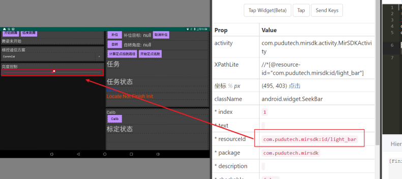

```python
#滑动步数（时间）
d=device(resourceId="com.pudutech.mirsdk:id/light_bar")
d.swipe('left', steps=30) #steps是向左滑动持续的时间


# 滑动操作 4 个参数：从某个初始坐标滑动到终点坐标
# startx, starty, endx, endy
d.swipe(600, 400, 100, 400)

#通过百分比滑动(不定位元素直接全局滑动，向左滑动百分之五十）
device.swipe_ext('left', scale=0.5)
```


#### 8：用户输入操作
    当遇到密码输入或者某个输入框的时候，需要模拟用户输入。例如下面输入点击的控制速度，然后再点击向前。（类似先输入用户名和密码，再点击登录这样的操作）
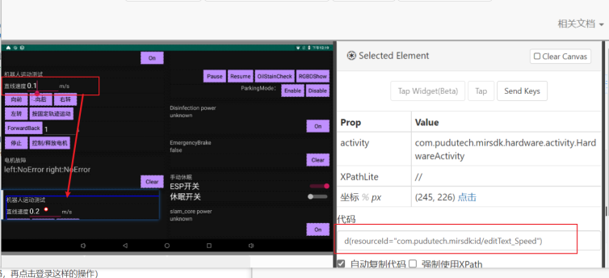

```python
import uiautomator2 as u2

device = u2.connect()

#定位到该输入框
editSpeed=device(resourceId="com.pudutech.mirsdk:id/editText_Speed")

#输入0.2
editSpeed.send_keys('0.2')
```
执行该脚本后，可以看到屏幕上的直线速度从0.1变成了0.2.
#### 9：等待操作
    由于我们程序上的代码执行的比较快，但是页面的显示和加载需要一定的时间，比如你代码已经执行了下一个页面的点击事件，但是实际上页面还没显示出来。因此我们需要用到等待，等待分为两种，强制睡眠等待以及智能等待。例子：例如现在点击SDK的自检按钮StartUp，此时会进入自检页面，但是需要等一会儿，自检才结束，此时Finish按钮才会出现。
```python
import uiautomator2 as u2

device = u2.connect()

#点击自检按钮
device(resourceId="com.pudutech.mirsdk:id/buttonStartUp").click()
#强制等待使用 time.sleep(10),不推荐使用，假如10S内仍未自检完成，调用后续按钮没有效果
#等待Finish按钮出现
device(text='Finish').wait()
#按下Finish按钮
device(resourceId="com.pudutech.mirsdk:id/buttonAction").click()
```
后续更深入的学习以及操作请自行百度学习。
### SDK页面点检脚本实战
#### 1：SDK自动化框架点检演示视频
[]()#### 2：演示python代码

```python
import uiautomator2 as u2

# 连接手机 adb
#d = u2.connect(r'SHW1HA8KWL')
# d(resourceId="com.pudutech.mirsdk:id/buttonStartUp").wait()
d = u2.connect(r'SHW1HA8KWL')
# d = u2.connect()
# wait 超时时间，30s
d.implicitly_wait(30)

# # wait 超时时间，20s
d.app_start('com.pudutech.mirsdk', wait=True)

d(resourceId="com.pudutech.mirsdk:id/buttonStartUp").click()

d(text='Finish').wait(timeout=50)

d(resourceId="com.pudutech.mirsdk:id/buttonAction").click()

#点击调试模式开关
d(resourceId="com.pudutech.mirsdk:id/switchInstallMode").click()

#进入硬件页面
d(resourceId="com.pudutech.mirsdk:id/buttonHardware").click()
d(resourceId="com.pudutech.mirsdk:id/button_IRLight").wait()
d.swipe_ext('down', scale=0.5)
d.press("back")
d(resourceId="com.pudutech.mirsdk:id/bt_mircore").wait()
d(resourceId="com.pudutech.mirsdk:id/bt_mircore").click()
d(resourceId="com.jb.emoji.gokeyboard:id/topmenu_hidekeyboard_btn").click()
d(resourceId="com.pudutech.mirsdk:id/bt_get_greet_region").click()
d(resourceId="com.pudutech.mirsdk:id/txt_greet_dist").send_keys('1.1')
d(resourceId="com.jb.emoji.gokeyboard:id/topmenu_hidekeyboard_btn").click()
d(resourceId="com.pudutech.mirsdk:id/txt_greet_angle").send_keys('130')

d(resourceId="com.jb.emoji.gokeyboard:id/topmenu_hidekeyboard_btn").click()

d(resourceId="com.pudutech.mirsdk:id/bt_set_greet_region").click()
d.press("back")

d(resourceId="com.pudutech.mirsdk:id/bt_system").wait()
d(resourceId="com.pudutech.mirsdk:id/bt_system").click()
d.xpath('//*[@resource-id="com.android.settings:id/list"]/android.widget.LinearLayout[6]/android.widget.RelativeLayout[1]').wait()
d.press("back")
d(resourceId="com.pudutech.mirsdk:id/bt_wifi").wait()
d(resourceId="com.pudutech.mirsdk:id/bt_wifi").click()
d(text="WLAN").wait()
d.press("back")
d(resourceId="com.pudutech.mirsdk:id/bt_switchPointMap").wait()
d(resourceId="com.pudutech.mirsdk:id/bt_switchPointMap").click()

d(resourceId="android:id/text1", text="不睡觉").click()

d(text='Success').wait()
d(resourceId="com.pudutech.mirsdk:id/bt_switchPointMap").click()
d(resourceId="android:id/text1", text="大卖").click()

d(text='Success').wait()
d.swipe_ext('up', scale=0.8)

d(resourceId="com.pudutech.mirsdk:id/button_goto").wait()
d(resourceId="com.pudutech.mirsdk:id/button_goto").click()
d(resourceId="android:id/text1", text="floor 0 1()[table]").wait()
d(resourceId="android:id/text1", text="floor 0 1()[table]").click()
d.swipe_ext('up', scale=0.5)

d(resourceId="com.pudutech.mirsdk:id/light_bar").wait()
e=d(resourceId="com.pudutech.mirsdk:id/light_bar")
e.swipe('left', steps=100)
d.swipe_ext('down', scale=0.9)

```


#### 3：总结
   本文只是抛砖引玉，让大家了解一下自动化测试框架，例如UIAuomatou2是一个很好的黑盒测试工具，测试开发人员不需要知道内部的应用程序结构，可以完全依赖于可见的UI元素。但是WebView这类的元素无法解析，只支持原生的应用。当然也可以通过Espresso这个框架进行白盒测试，测试开发人员必须充分熟悉并且会使用Android代码。Espresso的测试非常可靠，并且运行速度很快，但是一次只能测试一个应用程序。因此各有优劣，也可以结合使用。总之，学会并且熟练使用各种主流自动化框架，能够降低自己的时间成本，减少重复的劳动，提高测试质量，提高自己的核心竞争力。
