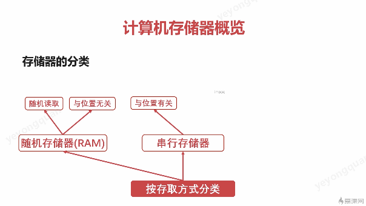

# 计算机组成

## 总线

### 概述

总线的出现 避免的 各个设备之间互相 所导致的复杂连接

分为 片内总线，系统总线

片内总线：芯片内部的总线

总线里有 数据总线、 地址总线 、控制总线。

### 总线仲裁

为什么要仲裁？

如下图， 控制总线检测 硬盘和 IO设备都准备就绪了。
都想和主存通讯 这个时候该给谁呢？ 
这个时候就需要仲裁的介入了

总线的仲裁就是为了解决分配总线使用权的问题。

总线仲裁的方法：

- 链式查询
- 计时器定时查询
- 独立请求

#### 链式查询

链式查询是有优先级的， 也就是有可能 低优先级的设备永远都拿不到。

#### 计时器定时查询

简单来说就是
仲裁控制器中 有一个计数器 所有的设备都可以向他发送请求。
计数器收到一个请求就+1.
并且没有收到请求时就把当前计数给发送出去。
如果发送出去的值和设备编号一致的话，那就可以被仲裁为可以通讯。

#### 独立请求

仲裁控制器 单独的发送和接受请求。
同时收到多个请求时  仲裁器按照自己的逻辑来确定优先级分配。

## 存储器

### 存储的分类

#### 按照介质分类

#### 按照读取方式分类

#### 存储器的层次结构

从这个层次图可以看出来， cpu  是不会直接和 硬盘打交道的。
只有  主存（内存条）才和 硬盘做数据交互。

## 内存

主存数据断电后 为啥会丢失呢？
因为主存是电容存储， 每隔一段时间就得刷新一下， 要不电容里的电子就都跑光了。

主存的大小是受操作系统的位数约束的。
像32位系统，由于地址总线只有32位，所以只能在232 （4GB） 范围内寻址,所以说给32位的系统配置超过4GB的内存是没有意义的。

辅存 （磁盘）为啥断电后 还能保留数据呢？
那就是因为 磁盘是靠磁性来判断0,1的，不依赖电来保持状态。所以说断电后仍然能够保持。

磁盘读取的算法

## 高速缓存

高速缓存是为了解决 cpu和 主存的速度不匹配的问题的。

### 工作原理

字： 存储单元最小单位
字块：存储在连续的存储单元中的字的集合

字的地址：  字块地址+字在字块中的位置

主存和缓存的存储结构类似
但是缓存大小远小于主存

用到缓存的情况有两种：

1. cpu 需要的数据在缓存里面  ，就直接从缓存中拿
2. cpu 需要的数据不在缓存中 ， 那就得从 主存里拿， 效率就会低很多。

也就是 cpu在缓存中的数据命中率

命中率越高的话， 缓存的作用就越大。
怎么样让命中率变高？ 这就是替换策略要考虑的事情了。

### 替换策略

替换的时机？
高速缓存中没有cpu要的数据时， 就从主存中取数据出来。

#### 替换算法

## 机器指令

### 机器指令的形式

操作码+ 地址码
注意： 机器指令的长度不是固定的，也就是说，不是一次总线传输就能把指令全部传完的。

地址码： 直接给出操作数 或者操作数的地址

三地址指令

addr3 就是  结果存储的地址

二地址指令
结果放在地址1 或者地址2

1地址指令

操作结果放回原地址

无地址指令

### 机器指令的操作类型

### 机器指令的寻址方式

指令寻址
数据寻址

数据寻址 中有种间接寻址。
这种间接寻址 机器指令中传入的是 操作数的地址的地址。
这个转几道的操作的意义是啥?
稍微查了下，最大的意义是 操作数是动态的。
概念就有点像指针的感觉。
而且也可以扩大操作数的范围。

## CPU

### 控制器

程序计数器：保存将要执行的指令的器件

然后执行执行时会计算当前指令所占的字节数，
加到程序计数器上去，这样程序计数器上就能一直保持指向下一个指令。
注意程序计数里保存的是 下一条指令的地址，而不是内容。这个地址一般是在高速缓存里。
网上说程序执行一条之后，就加个1。
有点不明白， 指令的长度都不确定 地址怎么就是加一呢？
网上查了下， 的确不是每次加1.
教学是说 1 也没太大问题。
这个1指的是1个指令长度。
有些cpu的指令长度是固定的，有些是不固定的。
比如x86就是不固定的。

时许发生器：
提供时序脉冲，cpu的时钟。

指令译码器：
计算机的指令是分为 操作码和地址码的。
指令译码器的作用就是翻译 操作码对应的操作
以及控制传输地址码对应的数据

指令寄存器：
缓存从主存或者高速缓存中读取出来的计算机指令
和程序计数器不一样的是指令寄存器储存的是当前正在执行的指令的地址；

指令寄存器的数据来源是从程序计数器所指的地址读出来的。

主存地址寄存器：保存当前cpu正要访问的内存单元的地址

主存数据寄存器： 保存当前cpu正要读/写的数据

通用寄存器： 暂存 各种数据 包括运算器的ALU的临时结果

### 运算器

###  计算机指令的执行过程

#### 指令执行的过程

- 取指令
- 分析指令
- 执行指令

先把数据和指令缓存到高速缓存中，

在这个流程中，可以发现 运算器和控制器的工作的分开的,这就导致利用率低的问题。
因此 有了流水线设计。

#### CPU的流水线设计

从下图 来看， 有取指令 ，分析指令，执行指令其实是可以并行的，所以说可以设计个三级流水线来提高cpu的利用率

